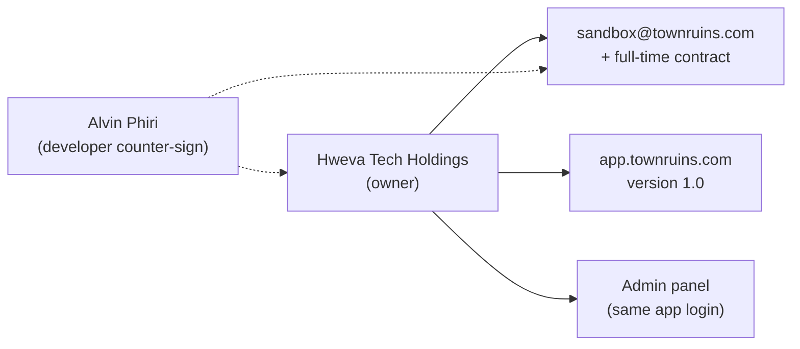

# Welcome

| Field | Value |
| --- | --- |
| **Title** | Town Ruins Owner Pack — Welcome |
| **Audience** | Platform owners (Hweva Tech Holdings) |
| **Version** | 1.0 |
| **Product** | [https://app.townruins.com](https://app.townruins.com) |
| **Support** | [sandbox@townruins.com](mailto:sandbox@townruins.com) |
| **Related** | [02 Quick Start](02-Quick-Start.md) · [14 Support and Warranty](14-Support-and-Warranty.md) · [15 Project Acceptance](15-Project-Acceptance.md) |

---

## Congratulations — ownership is yours

**Town Ruins version 1.0** is delivered and live. This pack is not a thin client overview: it is the **ownership transfer** record and day-to-day operating set for **Hweva Tech Holdings**.

You own the platform. You (and your staff) run accounts, listings, bookings, tokens, and moderation decisions from the **admin panel**. The developer counter-sign for delivery and bounded support is **Alvin Phiri**. Support contact for product and delivery questions is [sandbox@townruins.com](mailto:sandbox@townruins.com).

---

## What was delivered

Version **1.0** is the production Town Ruins platform: a marketplace for temporary stays where tenants, landlords, and accommodation providers operate, and **you** operate the business from the same web app using admin credentials.

| Area | What you received |
| --- | --- |
| **Live product** | Production app at [https://app.townruins.com](https://app.townruins.com) |
| **Admin operating surface** | Admin dashboard in the same app (no separate admin-only website) |
| **End-user experience** | Tenant, landlord, and provider flows on the public product |
| **Owner operating pack** | This document set under `docs/owner-pack/` — welcome through acceptance |
| **Acceptance version** | **1.0** — formal acceptance is documented in [15 Project Acceptance](15-Project-Acceptance.md) |

What ships in 1.0 is described in full across this pack (especially [06 Feature Catalogue](06-Feature-Catalogue.md) and [13 Release Notes](13-Release-Notes.md) when published). Real limits belong there — not as “planned later” language inside operating manuals.

---

## Where to open the product

| What | Where |
| --- | --- |
| **Production** | [https://app.townruins.com](https://app.townruins.com) |
| **Admin access** | Same URL — sign in with **admin credentials** you were given for ownership. There is no separate admin host. |
| **Support email** | [sandbox@townruins.com](mailto:sandbox@townruins.com) |

If you do not yet have admin credentials, request them through the support email above as part of delivery/acceptance.

---

## Support and warranty

- **Day-to-day questions** about the product and this engagement: email [sandbox@townruins.com](mailto:sandbox@townruins.com).
- **Warranty and support boundaries** follow your **full-time contract** with the developer. This pack does **not** invent fixed response times or SLAs. Full wording lives in [14 Support and Warranty](14-Support-and-Warranty.md) (when published) and in the contract itself.
- **Developer counter-sign** for acceptance and delivery: **Alvin Phiri**.

---

## How to use this pack next

Start here, then branch by need:

| Order | Document | Why |
| --- | --- | --- |
| 1 | **This Welcome** | Orientation, ownership framing, key contacts |
| 2 | [02 Quick Start](02-Quick-Start.md) | 10–15 minute first login and safe admin checks |
| 3 | [11 Daily Operations](11-Daily-Operations.md) · [07 Admin Panel Guide](07-Admin-Panel-Guide.md) | Running the platform day to day |
| 4 | [08 FAQ](08-FAQ.md) · [09 Troubleshooting](09-Troubleshooting.md) · [14 Support and Warranty](14-Support-and-Warranty.md) | When something is unclear or wrong |
| 5 | [15 Project Acceptance](15-Project-Acceptance.md) | Formal acceptance of version **1.0** |

The full map and conventions are in [00 README](00-README.md).

---

## Ownership at a glance

You are not a guest on this product. You are the owner. Welcome to operating Town Ruins.
