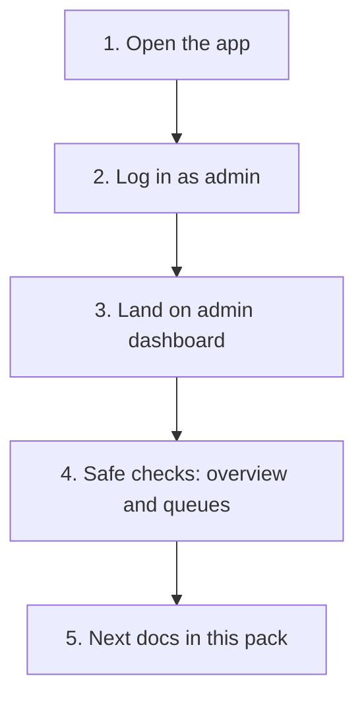

# Quick Start

| Field | Value |
| --- | --- |
| **Title** | Town Ruins Owner Pack — Quick Start |
| **Audience** | Platform owners (Hweva Tech Holdings) |
| **Version** | 1.0 |
| **Product** | [https://app.townruins.com](https://app.townruins.com) |
| **Support** | [sandbox@townruins.com](mailto:sandbox@townruins.com) |
| **Related** | [01 Welcome](01-welcome) · [07 Admin Panel Guide](07-admin-panel-guide) · [11 Daily Operations](11-daily-operations) |

---

## What this is

A **10–15 minute** first path for owner staff. By the end you will have opened production, signed in as admin, landed on the admin dashboard, and completed a few **safe look-only checks** (overview and queues). You will not change live data in this walkthrough.

**You need**

- A computer and a modern browser
- Admin email and password for Town Ruins (issued as part of ownership transfer)
- About 10–15 minutes uninterrupted

**You do not need** engineering tools, code access, or a separate “admin website.” Everything is on [https://app.townruins.com](https://app.townruins.com).

---

## Path at a glance

| Step | Time | Goal |
| --- | --- | --- |
| 1. Open the app | ~1 min | Confirm production loads |
| 2. Log in as admin | ~2 min | Sign in with owner admin credentials |
| 3. Admin dashboard | ~2 min | Confirm you are in the operating surface |
| 4. First safe checks | ~5–8 min | Overview + queues — look only |
| 5. Where next | ~1 min | Know which pack docs to open |

---

## Step 1 — Open the app

1. Open your browser.
2. Go to: **[https://app.townruins.com](https://app.townruins.com)**
3. Confirm the site loads (home page or sign-in, without a blank screen).

> **Screenshot:** `[SCREENSHOT: quick-start-production-home]`
>
> - **Where:** Browser → https://app.townruins.com
> - **Shows:** Production site loaded (home or entry screen)
> - **Capture later:** Yes — full text is complete without the image

If the page does not load, note the time and any error message, then email [sandbox@townruins.com](mailto:sandbox@townruins.com). Do not invent a different URL.

---

## Step 2 — Log in as admin

1. Open the **Login** (or **Sign in**) path from the site.
2. Enter the **admin** email and password you were given for ownership.
3. Submit the form and wait for the app to finish signing you in.

> **Screenshot:** `[SCREENSHOT: quick-start-login]`
>
> - **Where:** App → Login screen
> - **Shows:** Sign-in form before credentials are entered
> - **Capture later:** Yes — full text is complete without the image

**What success looks like**

- You are signed in (your name or account control appears in the header).
- You are taken into a **dashboard** for administrators — not a tenant, landlord, or provider home.

**If login fails**

| What you see | What to try |
| --- | --- |
| Wrong email or password | Re-type carefully; check Caps Lock |
| Account not recognized | Confirm you are using the **admin** account issued for ownership, not a personal tenant account |
| Still blocked | Email [sandbox@townruins.com](mailto:sandbox@townruins.com) — do not create a new admin account yourself |

There is **no separate admin host**. Admin access is this same app with the right credentials.

---

## Step 3 — Land on the admin dashboard

After a successful admin login you should be on the **admin dashboard** (the main operating home for owners).

If you are not sure you are there:

1. Use the **Dashboard** link in the site header (often highlighted for admin).
2. Confirm the screen is clearly for **platform administration** (overview, queues, moderation-style sections) — not a personal listing or booking workspace for a single landlord or tenant.

> **Screenshot:** `[SCREENSHOT: quick-start-admin-dashboard]`
>
> - **Where:** App → Admin dashboard (after admin login)
> - **Shows:** Admin home / overview as the main operating surface
> - **Capture later:** Yes — full text is complete without the image

**Security note:** Keep admin credentials private. Prefer one account per person so actions can be traced later. Do not share passwords in chat or email threads beyond the secure handover channel.

---

## Step 4 — First safe checks (look only)

These checks confirm the operating surface is usable. **Do not approve, reject, suspend, settle, or delete anything** on this first pass unless you already know that is your job today.

### 4a — Overview

1. On the admin dashboard, find the **overview** or summary area (counts, status tiles, or high-level totals).
2. Note whether numbers load (even if some are zero).
3. Mentally mark: “Overview is readable.”

> **Screenshot:** `[SCREENSHOT: quick-start-admin-overview]`
>
> - **Where:** Admin panel → Overview / dashboard summary
> - **Shows:** Summary counts or status tiles for the platform
> - **Capture later:** Yes — full text is complete without the image

### 4b — Queues

1. Find **queue** or **moderation** style sections (items waiting for review — for example accommodations, reports, disputes, or similar pending work).
2. Open one queue list if it is clearly available from the dashboard.
3. Confirm you can see a list (including an empty list). Do **not** change item status yet.

> **Screenshot:** `[SCREENSHOT: quick-start-admin-queues]`
>
> - **Where:** Admin panel → Moderation / queues area
> - **Shows:** At least one queue or pending-work list (may be empty)
> - **Capture later:** Yes — full text is complete without the image

### 4c — Optional orientation (still safe)

If the navigation is clear, click through **one or two** admin sections (for example listings, bookings, or reports) **only to see the list screens**, then return to the dashboard. Still no irreversible actions.

### Safe-check checklist

| Check | Done? |
| --- | --- |
| Production URL opens | ☐ |
| Admin login succeeds | ☐ |
| Admin dashboard visible | ☐ |
| Overview / summary readable | ☐ |
| At least one queue or pending list visible (or empty) | ☐ |
| No approve / reject / suspend / settle / delete performed | ☐ |

---

## Step 5 — Where to go next in this pack

| If you need to… | Open |
| --- | --- |
| Understand ownership and contacts again | [01 Welcome](01-welcome) |
| Run the platform day to day | [11 Daily Operations](11-daily-operations) |
| Learn admin screens in depth | [07 Admin Panel Guide](07-admin-panel-guide) · [04 Administrator Guide](04-administrator-guide) |
| Support end users | [03 User Manual](03-user-manual) · [08 FAQ](08-faq) · [09 Troubleshooting](09-troubleshooting) |
| Support contact and warranty | [14 Support and Warranty](14-support-and-warranty) |
| Formal acceptance of version 1.0 | [15 Project Acceptance](15-project-acceptance) |
| Full map of the pack | [00 README](00-readme) |

**Suggested next hour:** skim Daily Operations, then the Admin Panel Guide, with FAQ and Support/Warranty bookmarked.

### When you need more

Outside the pack, the Owner portal bridges are (Product/Legal are indexes — see [00 README](00-readme) honesty notes):

| Area | Go here |
| --- | --- |
| **Operations** | [Operations](../operations) |
| **Product** | [Product](../product/) (index; Feature Catalogue for shipped truth) |
| **Legal** | [Legal](../legal/) (portal index only) |
| **Workflows** | [Workflows](../workflows/) |

---

## Quick reference

| Item | Value |
| --- | --- |
| Production | https://app.townruins.com |
| Admin | Same app — admin credentials |
| Support | sandbox@townruins.com |
| Version | 1.0 |
| Owner | Hweva Tech Holdings |

If anything in this path fails and you cannot continue, stop and email [sandbox@townruins.com](mailto:sandbox@townruins.com) with what step you were on and what you saw.
