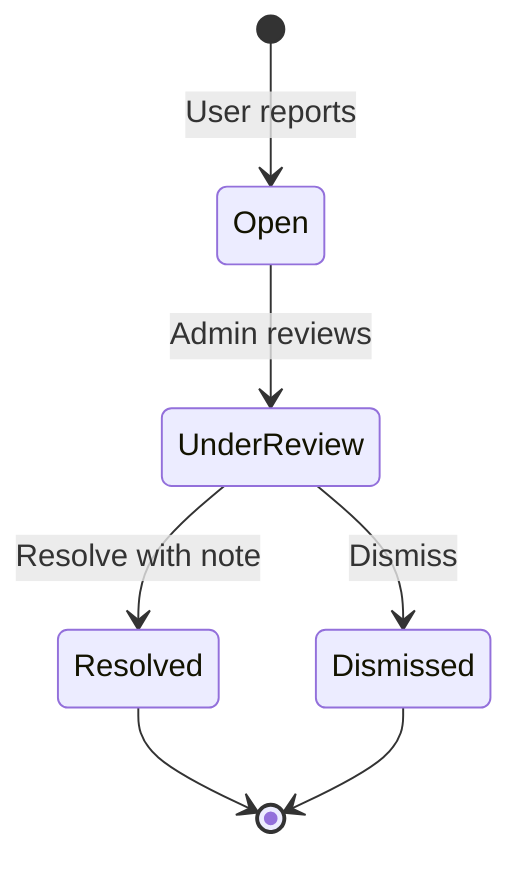

# User Manual

| Field | Value |
| --- | --- |
| **Title** | Town Ruins Owner Pack — User Manual |
| **Audience** | Platform owners (Hweva Tech Holdings) |
| **Version** | 1.0 |
| **Product** | [https://app.townruins.com](https://app.townruins.com) |
| **Support** | [sandbox@townruins.com](mailto:sandbox@townruins.com) |
| **Related** | [04 Administrator Guide](04-administrator-guide) · [07 Admin Panel Guide](07-admin-panel-guide) · [02 Quick Start](02-quick-start) · [11 Daily Operations](11-daily-operations) |

---

## Purpose

This is the **illustrated plain-language operating manual** for owner staff who run Town Ruins day to day.

It is **admin-primary**: you use the same production app as everyone else, signed in with **admin** credentials. Tenant, landlord, and provider journeys appear only as far as you need to **support** those users — not as equal-depth product manuals for them.

| If you need… | Use this instead |
| --- | --- |
| First login walkthrough (look-only) | [02 Quick Start](02-quick-start) |
| Morning/weekly checklists | [11 Daily Operations](11-daily-operations) |
| Button-level page reference | [07 Admin Panel Guide](07-admin-panel-guide) |
| Task playbooks (suspend, settle, legal) | [04 Administrator Guide](04-administrator-guide) |
| Who can do what | [10 Roles and Permissions](10-roles-and-permissions) |

Screenshots will be captured later. Every major screen uses a labeled placeholder so procedures stay complete without images.

---

## Before you start

| You need | Notes |
| --- | --- |
| Browser | Modern desktop browser recommended for admin work |
| URL | [https://app.townruins.com](https://app.townruins.com) — **no separate admin website** |
| Credentials | Your own **admin** or **super_admin** email and password |
| Mindset | You are the **owner operator**, not an external client |

**Security habit:** Do not share admin passwords. Each staff member should have their own account so audit logs show who did what.

---

## 1. Log in

### Steps

1. Open [https://app.townruins.com](https://app.townruins.com).
2. Open **Login** / **Sign in**.
3. Enter your **admin** email and password.
4. Submit and wait for the app to finish signing you in.

### What success looks like

- You are signed in (account control appears in the header).
- You land on the **admin dashboard** (platform operating home) — not a tenant, landlord, or provider workspace.
- You can also open **Dashboard** in the header (often highlighted for admin) if you are not already there.

> **Screenshot:** `[SCREENSHOT: user-manual-login]`
>
> - **Where:** App → Login screen
> - **Shows:** Sign-in form before credentials are entered
> - **Capture later:** Yes — full text is complete without the image

### If login fails

| What you see | What to try |
| --- | --- |
| Wrong email or password | Re-type carefully; check Caps Lock |
| Account not recognized | Confirm you are using the **admin** account issued for ownership, not a personal tenant account |
| Email not verified (public roles) | For end users: resend verification + spam folder — see [Supporting end users](#12-supporting-end-users-what-owners-need-to-know) |
| Still blocked for admin staff | Email [sandbox@townruins.com](mailto:sandbox@townruins.com) — do **not** create a new admin via public sign-up |

There is **no public “Create admin account”** button. Admin accounts are provisioned by a **controlled seed / operator process** only ([04 Administrator Guide](04-administrator-guide)).

---

## 2. Password reset

### For your own admin account

1. On the login screen, open **Forgot password** (or equivalent).
2. Enter the email for your admin account.
3. Open the reset link from the email (check spam if delayed).
4. Set a new password and sign in again.

> **Screenshot:** `[SCREENSHOT: user-manual-password-reset]`
>
> - **Where:** App → Forgot password flow
> - **Shows:** Request-reset form
> - **Capture later:** Yes — full text is complete without the image

### Helping an end user reset

| Guidance to give the user | Owner note |
| --- | --- |
| Use **Forgot password** on the public login page | Self-service first |
| Check spam / promotions for the reset email | Most “no email” cases |
| Confirm they use the email they registered with | Typos are common |
| After reset, complete login | If still failing and many users fail at once → product/mail issue → support email |

You do **not** need the developer to reset every forgotten password. Escalate when the **reset system is broken for everyone**, not for one mistyped address.

---

## 3. Admin dashboard overview

After admin login you work from the **admin dashboard** — the main operating surface for Hweva Tech Holdings.

### What the dashboard is for

| Area | Why it matters |
| --- | --- |
| Overview / queue counts | See whether the day is quiet or busy |
| Listings | Inactive / expired stock; revive or deactivate |
| Landlords / verification | Identity review when documents are submitted |
| Providers | Verify hosts; commission; suspend/reinstate |
| Accommodations | Approve, reject, suspend, reinstate short-stay properties |
| Bookings | View all stays; settle completed stays |
| Disputes | Review and resolve booking conflicts |
| Reports | Trust & safety on listings, stays, reviews |
| Reviews | Publish / unpublish public reputation |
| Legal documents | Terms, privacy, and related public legal pages |
| Audit logs | Who did what (accountability) |

Exact section labels and navigation order may vary slightly by build; use the dashboard navigation and the page-by-page map in [07 Admin Panel Guide](07-admin-panel-guide).

> **Screenshot:** `[SCREENSHOT: user-manual-admin-dashboard]`
>
> - **Where:** Admin panel after login as admin
> - **Shows:** Main admin home and entry points to operating sections
> - **Capture later:** Yes — full text is complete without the image

### Safe first habit

On a busy day: open the dashboard → clear **verification / providers / accommodations** → **reports / disputes** → **bookings needing settlement**. That order matches [11 Daily Operations](11-daily-operations).

---

## 4. Managing users

### Honest v1.0 limit

There is **no full “browse all users” list** in the admin dashboard in version 1.0. You cannot open a complete user directory the way a CRM would.

| Need | What you can do in v1.0 |
| --- | --- |
| Help someone log in | Guide self-service (verify email, reset password) |
| See activity tied to bookings / listings / reports | Use those admin sections, not a global user grid |
| Remove a bad actor entirely | Account **deletion** is available as an **admin power** but is **irreversible** and cascading — use only with confirmed business intent ([04](04-administrator-guide)) |
| Grant promo TR Tokens | **No dedicated grant UI** — contact [sandbox@townruins.com](mailto:sandbox@townruins.com) or the developer under the full-time contract for technical support paths |

Do not invent a user-management screen that is not there. Prefer business decisions in the tools you **do** have (listings, providers, reports, disputes).

> **Screenshot:** `[SCREENSHOT: user-manual-users-gap-note]`
>
> - **Where:** N/A — no dedicated users list UI in v1.0
> - **Shows:** Placeholder only for future UI if product adds a user list
> - **Capture later:** Yes — full text is complete without the image

### Profile and display preferences (your own account)

Signed-in users (including admin) can maintain their own profile (username, email, avatar, password) and display preferences such as dark / light mode where the product offers them. Use your own profile tools for **your** account; do not share that account.

---

## 5. Managing landlords

Landlords list **long-term rentals**. They self-register; you do not create every landlord account.

### What you do as owner

| Situation | Owner action |
| --- | --- |
| New landlord cannot log in | Email verification / password reset guidance |
| Landlord wants a second active listing | Explain v1.0 limit: **one active listing per landlord** — do not invent exceptions |
| Listing is spam, fraud, or policy-breaking | Deactivate / moderate via Listings; handle **Reports** |
| Identity documents submitted | Review and **approve** or **reject** (see next section) |
| Listing expired / inactive | Landlord can restore with TR; you may **bulk revive** when policy allows |

> **Screenshot:** `[SCREENSHOT: user-manual-landlords]`
>
> - **Where:** Admin panel → landlord / verification-related section
> - **Shows:** Where owner staff work landlord identity review (UI may be partial)
> - **Capture later:** Yes — full text is complete without the image

---

## 6. Verifying landlords

Landlords may submit **ID image + selfie** for identity verification.

### Statuses

| Status | Meaning | Your action |
| --- | --- | --- |
| Unverified | No documents submitted | None required |
| Pending review | Documents submitted | Review and decide |
| Approved / verified | Identity accepted | Verified badge behaviour per product |
| Rejected | Documents not accepted | Landlord may need to resubmit |

### How review works in practice

1. You may receive an email to the configured **admin notification** address when a submission arrives.
2. Review the submitted documents.
3. **Approve** if legitimate; **reject** if not, with a clear reason in your operating notes.

**v1.0 honesty (stated once):** The landlord verification **admin review UI may be partial**. Document submission exists. You still own the **business decision**. If tooling blocks you entirely, contact [sandbox@townruins.com](mailto:sandbox@townruins.com) or the developer under the full-time contract — do not invent a polished review screen that is not there.

> **Screenshot:** `[SCREENSHOT: user-manual-landlord-verification]`
>
> - **Where:** Admin panel → landlord identity review
> - **Shows:** Pending verification items (or available review surface)
> - **Capture later:** Yes — full text is complete without the image

---

## 7. Managing listings (long-term rentals)

### Statuses you will see

| Status | Business meaning |
| --- | --- |
| Draft | Landlord still building the listing |
| Pending payment | Activation / fee path not finished |
| Early access | Visible early (e.g. premium tenants) where product applies |
| Active | Live in search |
| Expired | Past end date — not visible; may be restored |
| Inactive | Deactivated for ops or policy |

### Common owner actions

| Action | When |
| --- | --- |
| Review inactive / expired stock | Weekly health of inventory |
| **Bulk revive** | Restore multiple good listings to active (set new expiry as prompted) |
| Deactivate | Remove from tenant search for policy or quality |
| Leave alone | Business call — not everything needs revival |

**Bulk revive (typical flow)**

1. Open the **Listings** section of the admin dashboard.
2. Filter / page through inactive (and related) listings.
3. Select listings to restore.
4. Choose **Bulk Revive**, set the new expiry as required, confirm.

> **Screenshot:** `[SCREENSHOT: user-manual-listings-moderation]`
>
> - **Where:** Admin panel → Listings
> - **Shows:** Inactive listings list with filters and bulk revive
> - **Capture later:** Yes — full text is complete without the image

### Supporting landlords about listings

| User complaint | Honest owner reply |
| --- | --- |
| “My listing isn’t in search” | Check status: pending payment, expired, inactive, early access |
| “I want two active listings” | Product limit in v1.0: one active listing |
| “Restore cost” | **1 TR × days** (up to **30 days**) paid by the landlord |

---

## 8. Temporary stay bookings

Temporary stays (hotels, lodges, BnBs) are a **separate** product path from long-term listings.

### Two commercial rules

| Rule | Meaning |
| --- | --- |
| **TR Tokens** | Premium platform actions (contact unlock, listing restore, etc.) use TR Tokens |
| **Stay exception** | Short-term room bookings use **real money** for charges, refunds, cancellations, and settlement — **not** TR Tokens |

### What you do as owner

| Task | Notes |
| --- | --- |
| View all bookings | Admin bookings section |
| Spot stuck stays | Pending confirmation, unpaid, cancelled, disputed |
| **Settle** completed stays | Enter a clear **settlement reference** |
| Resolve **disputes** | Owner decision authority |
| Verify **providers** and moderate **accommodations** | Gate before hosts operate fully |

Providers handle day-to-day confirm/decline for **request-mode** bookings. You intervene for verification quality, settlement, disputes, and policy — not every guest request.

> **Screenshot:** `[SCREENSHOT: user-manual-bookings]`
>
> - **Where:** Admin panel → Bookings
> - **Shows:** Platform-wide bookings list and settlement actions
> - **Capture later:** Yes — full text is complete without the image

### Booking statuses (plain language)

| Status | Meaning |
| --- | --- |
| Pending confirmation | Awaiting provider (request mode) |
| Pending payment | Awaiting guest payment |
| Confirmed | Paid/confirmed stay |
| Declined | Provider declined |
| Cancelled | Cancelled by guest, provider, or admin path |
| Checked in | Guest checked in |
| Completed | Stay finished — often ready for settlement |
| Expired | Expired without completing payment path |
| Refunded | Refund applied |

---

## 9. TR Tokens

TR Tokens are Town Ruins’ **in-app currency** for premium platform behaviour.

### Common token events

| Event | Amount | Who pays / receives |
| --- | --- | --- |
| Welcome bonus (first email verification or new Google user) | **100 TR** | Credit to user |
| Engagement approved (landlord accepts contact request) | **5 TR** | Debit from **tenant** |
| Listing restored | **1 TR × days** (up to 30) | Debit from **landlord** |
| Admin promo grant | Variable | Credit to user — **no full UI** in v1.0 |

### Supporting users about tokens

| Complaint | Owner response |
| --- | --- |
| “I was charged just for messaging” | Charge is on **approval**, not on send |
| “I got no welcome tokens” | Confirm email verification completed; if product-wide, escalate |
| “Token package didn’t charge my card” | **Known limit:** token **purchase** path may be **demo-only** in v1.0 — stay honest |
| “Please refund my TR” | Business decision; technical grant/adjust may need support under contract |

> **Screenshot:** `[SCREENSHOT: user-manual-tokens-context]`
>
> - **Where:** End-user wallet / dashboard (support context) or admin ops notes
> - **Shows:** Wallet balance concept users will describe to you
> - **Capture later:** Yes — full text is complete without the image

---

## 10. Payments (stays vs tokens)

| Domain | Payment type | Owner focus |
| --- | --- | --- |
| Temporary stay bookings | **Real money** via configured payment provider | Settlement references, disputes, refunds per policy |
| TR Token packages | May be **demo-mode** in v1.0 (no real charge until fully wired) | Do not promise live card charging for tokens if not live |
| Listing fees / premium membership | As product configures | Explain from feature catalogue; do not invent prices |

**When a user confuses the two:** “Room bookings are real money. Tokens are for platform features like contact unlock and listing restore.”

If a stay payment looks stuck and many users are affected, escalate as a product issue to [sandbox@townruins.com](mailto:sandbox@townruins.com). For one guest’s provider decline or policy cancel, treat it as normal operations first.

---

## 11. Notifications

Users receive notifications through several channels. Owners care because support often starts with “I never got told.”

| Channel | Owner note |
| --- | --- |
| In-app (bell / history) | Always available when signed in |
| Email | Depends on production mail configuration |
| Push (browser / PWA) | Requires push setup; user may deny permission |
| SMS | Off unless enabled and configured |

You do **not** operate notification servers as a daily admin task. You:

1. Distinguish **one user’s spam folder** from **platform-wide** delivery failure.
2. Guide users to check in-app notification history.
3. Escalate system-wide mail/push failures to support under contract.

> **Screenshot:** `[SCREENSHOT: user-manual-notifications-bell]`
>
> - **Where:** App header → notifications (admin or user view)
> - **Shows:** In-app notification entry point users will mention
> - **Capture later:** Yes — full text is complete without the image

---

## 12. Reports

Users can report listings, accommodations, and reviews for reasons such as spam, inappropriate content, fraud, or other.

### Owner workflow

1. Open **Reports** in the admin dashboard.
2. Mark an item **under review**.
3. Investigate the target content.
4. **Resolve** (with a short resolution note) or **Dismiss** (unfounded / duplicate).

> **Screenshot:** `[SCREENSHOT: user-manual-reports]`
>
> - **Where:** Admin panel → Reports
> - **Shows:** Report queue and review actions
> - **Capture later:** Yes — full text is complete without the image

---

## 13. Settings and legal content

### Legal documents (owner-controlled)

From **Legal documents** in the admin surface you manage public legal pages, including:

| Document | Typical public path |
| --- | --- |
| Terms of Use | `/terms` |
| Privacy Policy | `/privacy` |
| Landlord Agreement | `/landlord-terms` |
| Refund Policy | `/refund-policy` |
| Community Guidelines | `/community-guidelines` |
| Trust & Safety | `/trust-safety` |

**Create / update / archive** versions carefully: updates create a new version and archive the previous. This is a **policy** action, not a cosmetic edit.

> **Screenshot:** `[SCREENSHOT: user-manual-legal-docs]`
>
> - **Where:** Admin panel → Legal documents
> - **Shows:** Legal document list and version management
> - **Capture later:** Yes — full text is complete without the image

### Product feature toggles

Some capabilities ship **off** until enabled (for example featured listings, visibility boosts, phone verification UI). Owners should not expect those as live v1.0 acceptance features when they are documented as off or not in v1.0 — see [06 Feature Catalogue](06-feature-catalogue). Changing feature flags is a **configuration** matter; if you need a flag changed and have no operator UI for it, use support under the full-time contract rather than inventing a settings screen.

---

## 14. Log out

1. Open your account / profile menu in the header.
2. Choose **Log out** / **Sign out**.
3. Confirm the session ends (login screen or public home without admin tools).

**Shared machines:** Always log out. Do not leave an admin session open on a shared computer.

> **Screenshot:** `[SCREENSHOT: user-manual-logout]`
>
> - **Where:** App header → account menu
> - **Shows:** Logout control
> - **Capture later:** Yes — full text is complete without the image

---

## 15. Supporting end users (what owners need to know)

This section is **support-oriented only** — not a full tenant/landlord/provider product manual.

### Tenants (renters / guests)

| They try to… | What they should do | Common owner reply |
| --- | --- | --- |
| Register and enter | Public sign-up → verify email | Resend verification; check spam |
| Find long-term homes | Search/filter listings | Contact details unlock after landlord **approves** engagement |
| Contact a landlord | Send engagement | Free to send; **5 TR** only if approved |
| Book a short stay | Stay search → book → pay **real money** | Tokens are not room charges |
| Premium early access | Tenant premium membership where offered | Separate from token wallet rules |

### Landlords

| They try to… | What they should do | Common owner reply |
| --- | --- | --- |
| List a property | Listing wizard; one **active** listing | Second listing is not available in v1.0 |
| Get visible again | Restore with TR (1 TR × days) | Or ask you about bulk revive policy |
| Verify identity | Submit ID + selfie | You approve/reject; UI may be partial |
| Answer tenants | Approve/decline engagements | Approve charges the tenant 5 TR |

### Providers (short-stay hosts)

| They try to… | What they should do | Common owner reply |
| --- | --- | --- |
| Join as host | Provider sign-up | Wait for your **verification** |
| Go live | Rooms + approved accommodation | You moderate accommodations |
| Earn from bookings | Confirm requests; complete stays | You **settle** completed stays with a reference |
| Disagree with a guest | Raise dispute | You review and resolve/close |

### When to escalate off the product

| Situation | Escalate to |
| --- | --- |
| Site down for everyone, login broken platform-wide, payments failing widely | [sandbox@townruins.com](mailto:sandbox@townruins.com) / developer under full-time contract |
| One user forgot password | Self-service first — you coach them |
| Business decision (approve host, ban listing, settle dispute) | **You** — owner authority |

---

## 16. Dangerous actions (read before clicking)

| Action | Risk | Rule |
| --- | --- | --- |
| Delete a user account | **Irreversible**; cascades listings, bookings, payments, related records | Confirm identity and written business intent |
| Suspend provider / accommodation | Stops new business for that host | Use for policy/safety with notes |
| Bulk revive listings | Puts inventory back in search | Only revive listings that meet your standards |
| Update legal documents | Changes public contractual wording | Align with counsel / ownership |
| Settle a booking | Marks payout tracking complete | Use a unique, clear settlement reference |

---

## Related reading

| Need | Document |
| --- | --- |
| Day-to-day task playbooks | [04 Administrator Guide](04-administrator-guide) |
| Every admin page | [07 Admin Panel Guide](07-admin-panel-guide) |
| Morning / weekly lists | [11 Daily Operations](11-daily-operations) |
| Process “why” | [05 Business Processes](05-business-processes) |
| What shipped | [06 Feature Catalogue](06-feature-catalogue) |
| Roles | [10 Roles and Permissions](10-roles-and-permissions) |
| Who owns which decisions | [12 Data Ownership](12-data-ownership) |

---

*Town Ruins Owner Pack v1.0 · User Manual · Hweva Tech Holdings*
