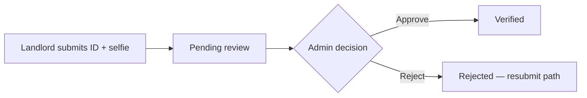
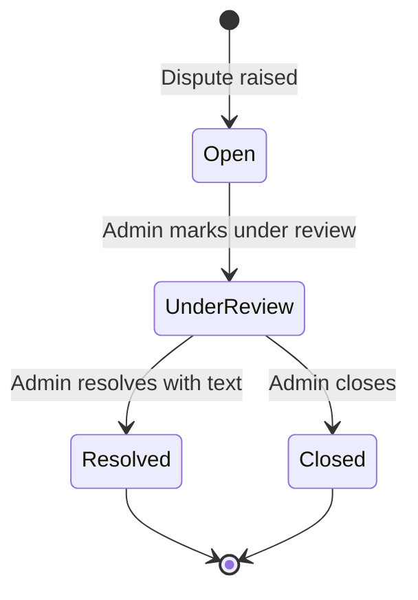

# Administrator Guide

| Field | Value |
| --- | --- |
| **Title** | Town Ruins Owner Pack — Administrator Guide |
| **Audience** | Platform owners (Hweva Tech Holdings) |
| **Version** | 1.0 |
| **Product** | [https://app.townruins.com](https://app.townruins.com) |
| **Support** | [sandbox@townruins.com](mailto:sandbox@townruins.com) |
| **Related** | [03 User Manual](03-User-Manual.md) · [07 Admin Panel Guide](07-Admin-Panel-Guide.md) · [11 Daily Operations](11-Daily-Operations.md) · [05 Business Processes](05-Business-Processes.md) |

---

## Purpose

This guide is the **day-to-day administrator playbook** for owner staff. It tells you **what to do** for common operating tasks — in plain language, on the admin surface of [https://app.townruins.com](https://app.townruins.com).

| Document | Role |
| --- | --- |
| This guide | Task playbooks: create staff access, verify, moderate, settle, resolve |
| [03 User Manual](03-User-Manual.md) | Broader illustrated orientation for owner staff |
| [07 Admin Panel Guide](07-Admin-Panel-Guide.md) | Page-by-page buttons, filters, and things to avoid |
| [11 Daily Operations](11-Daily-Operations.md) | Morning / weekly / monthly checklists |

**Not in this guide:** Deployment, server logs, database administration, or incident engineering runbooks. Those belong to technical operations and the developer engagement — not first-line owner work.

---

## Administrator overview

### What you own

As admin / super admin for Hweva Tech Holdings you:

- Verify landlords (when documents are submitted) and providers
- Moderate long-term listings and short-stay accommodations
- Handle reports, reviews, and booking disputes
- Settle completed temporary stay bookings
- Maintain legal document versions shown to the public
- Keep staff admin accounts secure and person-specific

### Admin vs super admin

| Point | What to know |
| --- | --- |
| Day-to-day UI | Both roles use the **same admin dashboard** |
| UI distinction | No meaningful separate super-admin-only screens in v1.0 |
| Practical use | Both are trusted **owner organisation** roles |
| Technical nuance | A few provider actions (verify / commission) have historically been tied to the exact **admin** role. If a super_admin account cannot complete provider verify or commission update, use a designated **admin** account or ask support under contract |

**Recommendation:** Keep at least one working `admin` account for full provider verification/commission actions. Do not run the platform as a personal tenant account.

### Two commercial rules

| Rule | Meaning |
| --- | --- |
| **TR Tokens** | Contact unlock, listing restore, and similar premium platform actions use TR Tokens |
| **Stay exception** | Temporary stay bookings use **real money** for charges, refunds, cancellations, and settlement |

---

## 1. Access the admin dashboard

1. Open [https://app.townruins.com](https://app.townruins.com).
2. Sign in with **your** admin email and password.
3. Land on the admin dashboard (or open **Dashboard** in the header).

> **Screenshot:** `[SCREENSHOT: admin-guide-dashboard-entry]`
>
> - **Where:** After admin login
> - **Shows:** Admin operating home
> - **Capture later:** Yes — full text is complete without the image

**Security:** Never share admin credentials. Audit trails depend on person-specific accounts.

---

## 2. Creating admin accounts (as done in v1.0)

### The rule

Admin accounts are **not** created through public sign-up. There is no “Register as administrator” path for the public.

### How admin accounts actually get created

| Method | Who uses it | Owner language |
| --- | --- | --- |
| **Controlled seed / provision process** | Delivery and technical operators | Super admin (and additional admins as agreed) are created by a **seeded / controlled process** during setup or when ownership requests new staff access |
| Public sign-up | Tenants, landlords, providers | **Never** produces a real admin role |

### What owner staff should do when a new admin is needed

1. Confirm the person is authorised by Hweva Tech Holdings leadership.
2. Do **not** tell them to register on the public site as admin — that will not work.
3. Request provisioning through the agreed ownership channel: [sandbox@townruins.com](mailto:sandbox@townruins.com) and/or the developer under the full-time contract.
4. Once credentials exist, the new admin should sign in, change password if a temporary one was issued, and use only their own account.

### Resetting an admin password

| Preference order | Action |
| --- | --- |
| 1 — Self-service | Use **Forgot password** on the login page when email delivery works |
| 2 — Support under contract | If self-service fails for staff accounts, contact [sandbox@townruins.com](mailto:sandbox@townruins.com) / developer for a controlled reset |

Do not treat “reset admin password via database” as the primary owner procedure. Prefer product self-service and contracted support.

---

## 3. Deactivating, suspending, and removing access

Different tools apply to different roles. Use the lightest action that protects the platform.

### Providers

| Action | Effect | When to use |
| --- | --- | --- |
| **Suspend** | Provider cannot accept new bookings; notification sent | Safety, fraud, serious policy breach |
| **Reinstate** | Normal operation restored; notification sent | Issue resolved |
| Reject at verification | Never fully onboarded | Failed vetting |

### Accommodations (short-stay properties)

| Action | Effect |
| --- | --- |
| **Reject** | Not published |
| **Suspend** | Unpublished; operations stopped |
| **Reinstate** | Approved and published again |
| **Approve** | Published for booking (when other requirements met) |

### Long-term listings

| Action | Effect |
| --- | --- |
| **Deactivate** → inactive | Removed from tenant search |
| **Bulk revive** | Restored to active with new expiry as set |

### Users / accounts

| Action | v1.0 reality |
| --- | --- |
| Full “suspend user” button on a user list | **No dedicated browse-all-users UI** in the dashboard |
| **Delete account** (admin power) | Available as an elevated capability; **irreversible** and cascading |
| Login problems | Prefer email verification + password reset coaching |

**Account deletion cascade includes** (among other related records): listings, accommodations/rooms, bookings/payments/refunds, notifications, reports, disputes, reviews, and the user record itself.

> ⚠️ **Always confirm identity and written business intent before deleting an account.** Prefer suspend / deactivate of content when that is enough.

> **Screenshot:** `[SCREENSHOT: admin-guide-suspend-provider]`
>
> - **Where:** Admin panel → Providers → suspend / reinstate
> - **Shows:** Provider actions for access control
> - **Capture later:** Yes — full text is complete without the image

---

## 4. Landlord identity verification review

### Process

1. Notice a pending submission (admin email notification and/or admin surface).
2. Review ID image and selfie for legitimacy and match.
3. **Approve** or **Reject**.
4. Record the reason in your internal ops notes if rejected.

### Statuses

| Status | Meaning |
| --- | --- |
| Unverified | Nothing submitted |
| Pending review | Waiting on you |
| Approved | Identity confirmed |
| Rejected | Not accepted |

**v1.0 honesty (stated once):** Full polished admin review UI may be **partial**. Submission exists. You still own the decision. If the tool blocks you entirely, contact [sandbox@townruins.com](mailto:sandbox@townruins.com) or the developer under contract — do not invent screens.

---

## 5. Provider verification and commission

### Verify a provider

1. Open **Providers** in the admin dashboard.
2. Find the provider (search by name/email; filter by verification status when available).
3. **Approve** (verify) or **Reject**.

| On approve | On reject |
| --- | --- |
| Provider verification becomes approved | Provider verification becomes rejected |
| Related accommodations move toward approved path | Accommodations rejected path |
| Provider receives approval notification | Provider receives rejection notification |

### Update commission rate

1. Find the provider.
2. Open **Update commission** (or equivalent).
3. Enter a rate between **0 and 100** (default commonly documented as **10%**).
4. Save — rate applies to the provider profile and their accommodations.

Set commission **deliberately** for commercial reasons; do not leave surprises for finance later.

### Suspend / reinstate

Use suspend when the host must stop taking new bookings without full deletion. Reinstate when the issue is closed.

> **Screenshot:** `[SCREENSHOT: admin-guide-providers]`
>
> - **Where:** Admin panel → Providers
> - **Shows:** Verification, commission, suspend actions
> - **Capture later:** Yes — full text is complete without the image

---

## 6. Removing inappropriate listings and accommodations

### Long-term listings

1. Open **Listings**.
2. Identify the listing (often via a **Report**, or landlord support request).
3. **Deactivate** so it leaves search.
4. Resolve the related **Report** with a note.

For large clean-ups of dead stock, use inactive filters and decide whether **bulk revive** or leave inactive is correct. Only revive listings that still meet your standards.

### Short-stay accommodations

1. Open accommodations / moderation queue.
2. Choose **Reject**, **Suspend**, or **Approve** / **Reinstate** based on policy.
3. Prefer **Suspend** for temporary enforcement; **Reject** when never acceptable.

### Reviews

| Action | Effect |
| --- | --- |
| **Publish** | Visible publicly |
| **Unpublish** | Hidden from public |

Use unpublish for abuse, spam, or policy-breaking review content.

> **Screenshot:** `[SCREENSHOT: admin-guide-listing-moderation]`
>
> - **Where:** Admin panel → Listings
> - **Shows:** Inactive list and moderation actions
> - **Capture later:** Yes — full text is complete without the image

---

## 7. Monitoring activity

### What “monitoring” means for owners (non-engineering)

| Surface | What you watch |
| --- | --- |
| Dashboard overview / moderation queue | Backlog volume |
| Reports | Trust & safety inflow |
| Disputes | Unresolved conflicts |
| Bookings | Stuck payments, unsettled completed stays |
| Providers / accommodations | Pending verification and moderation |
| Audit logs | Unexpected admin actions |
| Support inbox | Patterns (login, tokens, mail, payments) |

### Audit logs

Every admin action should leave an audit trail (who, what action, target, when).

1. Open **Audit logs** in the admin dashboard.
2. Review recent entries when investigating “who changed this?” or after a sensitive action.
3. Define your internal retention expectations offline; logs are not automatically purged by product policy in the technical guide.

> **Screenshot:** `[SCREENSHOT: admin-guide-audit-logs]`
>
> - **Where:** Admin panel → Audit logs
> - **Shows:** Admin action history
> - **Capture later:** Yes — full text is complete without the image

### What not to do

Do not treat **server logs**, **database queries**, or **deployment dashboards** as the primary owner monitoring path. If the product is broken platform-wide, escalate to support under contract.

---

## 8. Analytics, reports, and exports

### In-product analytics you may see

| Area | Examples |
| --- | --- |
| Reviews | Average rating, rating distribution, breakdown by accommodation |
| Queues | Counts of pending moderation / reports (where shown on dashboard) |
| Bookings list | Operational view of stay pipeline |

### Monthly record-keeping

1. Export or download booking/settlement/report records **when the tools allow**.
2. Store settlement references in your finance archive.
3. Archive notable dispute and report resolutions.

**v1.0 honesty:** If a needed export is missing, document the gap and use support under the full-time contract for technical extracts. Do not invent a reporting suite that is not on the admin surface.

---

## 9. Booking settlement

Settlement is how you mark that a completed temporary stay’s payout tracking is complete.

### Steps

1. Open **Bookings**.
2. Find a **completed** stay that is ready for settlement (payment received, stay finished).
3. Choose **Settle**.
4. Enter a clear **settlement reference** (your finance can reconcile it later).
5. Confirm — settlement status becomes **settled** with a timestamp.

### Tips

| Do | Don’t |
| --- | --- |
| Use unique, meaningful references | Settle without a reference “just to clear the list” |
| Settle completed, paid stays | Confuse TR Token balance with stay money |
| Keep a finance copy of references | Promise instant bank payout timing the product does not show |

> **Screenshot:** `[SCREENSHOT: admin-guide-settle-booking]`
>
> - **Where:** Admin panel → Bookings → Settle
> - **Shows:** Settlement action and reference field
> - **Capture later:** Yes — full text is complete without the image

---

## 10. Dispute management

Disputes are raised by guests or providers on bookings. Owner staff manage the lifecycle.

### Steps

1. Open **Disputes**.
2. Read reason, description, and who raised it (guest or provider).
3. Mark **Under review**.
4. Investigate booking, messages, and policy.
5. **Resolve** with written resolution text (both parties may be notified) **or** **Close** when no formal resolution is required (e.g. withdrawn).

### Writing good resolutions

| Good | Weak |
| --- | --- |
| Specific outcome and next step | “OK” with no detail |
| Fair to published policy | Silent favour without notes |
| Recorded in the product field | Only in a personal chat outside the system |

> **Screenshot:** `[SCREENSHOT: admin-guide-disputes]`
>
> - **Where:** Admin panel → Disputes
> - **Shows:** Dispute list and review/resolve actions
> - **Capture later:** Yes — full text is complete without the image

---

## 11. Report management

1. Open **Reports**.
2. Mark **Under review**.
3. Inspect the target (listing, accommodation, or review).
4. Take content action if needed (deactivate listing, suspend accommodation, unpublish review).
5. **Resolve** with a note or **Dismiss** if unfounded/duplicate.

Target types: **Listing**, **Accommodation**, **Review**. Reasons typically include spam, inappropriate, fraud, other.

---

## 12. Legal document management

### Documents in scope

| Slug / topic | Public URL (typical) |
| --- | --- |
| Terms of Use | `/terms` |
| Privacy Policy | `/privacy` |
| Landlord Agreement | `/landlord-terms` |
| Refund Policy | `/refund-policy` |
| Community Guidelines | `/community-guidelines` |
| Trust & Safety | `/trust-safety` |

### Operations

| Operation | Effect |
| --- | --- |
| **Create** | New document version 1 |
| **Update** | New version; previous archived |
| **Archive** | No longer the active public version |

Treat legal edits as **policy changes**. Align with ownership/counsel before publishing material rewrites.

> **Screenshot:** `[SCREENSHOT: admin-guide-legal-docs]`
>
> - **Where:** Admin panel → Legal documents
> - **Shows:** Document list and version controls
> - **Capture later:** Yes — full text is complete without the image

---

## 13. Settings and configuration (owner view)

| Topic | Owner action in v1.0 |
| --- | --- |
| Legal content | Managed in Legal documents (above) |
| Profile / password | Your own account settings |
| Feature flags (featured listings, boosts, phone verification, etc.) | Many ship **off**; not day-to-day toggle work for non-technical staff — request changes via support if business needs them |
| Payment provider, SMS, push keys | Technical configuration — not primary owner UI |
| Admin account creation | Controlled seed/process only (section 2) |

If something only exists as API/database configuration, your operational path is: **decide the business outcome** → contact [sandbox@townruins.com](mailto:sandbox@townruins.com) or the developer under full-time contract for the technical change — not “pretend a button exists.”

---

## 14. Wallet and TR Token administration

| Need | Owner path in v1.0 |
| --- | --- |
| Explain welcome **100 TR** | Product behaviour after first verification / new Google user |
| Explain engagement **5 TR** | Charged to tenant **only when landlord approves** |
| Explain listing restore | **1 TR × days** (up to 30) |
| Grant promo tokens | **No dedicated admin UI** — use support under contract for technical grant path |
| Token package purchase | May be **demo-only** — stay honest with users |

Do not tell users that token packages process real card charges if purchase remains demo-mode.

---

## 15. Support workflows (owner first line)

### User cannot log in

1. Confirm they use the correct email and role (tenant/landlord/provider vs admin).
2. Ask them to resend verification if never verified; check spam.
3. Direct to **Forgot password**.
4. If many users fail at once → product/mail issue → escalate.

### User reports missing tokens

1. Ask them to open wallet history in their dashboard.
2. Confirm verification completed (welcome bonus timing).
3. Explain engagement fee only on **approve**.
4. For genuine product errors, escalate with user email, time, and what they expected.

### Listing not appearing in search

1. Check listing status: active / early access / expired / inactive / pending payment.
2. If inactive, consider policy + bulk revive.
3. If expired, landlord restore with TR (or your revive policy).
4. Escalate only if status is correct but search is still broken widely.

### Payment not confirmed (stay)

1. Confirm this is a **stay** booking (real money), not a token package.
2. Check booking/payment status in admin bookings.
3. If many pending failures, escalate as payment-provider/product issue.
4. Do not invent a manual “mark paid” button unless the product shows one.

---

## 16. Known operational limitations (owner framing)

| Limitation | What you should do |
| --- | --- |
| No full user list UI | Support via bookings/listings/reports; escalate for technical extracts |
| No token-grant UI | Support under contract for promo corrections |
| Landlord ID review UI partial | Still decide; escalate if blocked |
| Token purchase demo-mode | Honest communication; stay bookings remain real money |
| Super admin vs admin provider nuance | Keep a working `admin` account for verify/commission |
| Feature flags off for some roadmap features | Do not treat as delivered v1.0 acceptance features |

Full product catalogue of what shipped: [06 Feature Catalogue](06-Feature-Catalogue.md).

---

## 17. Things administrators should avoid

| Avoid | Why |
| --- | --- |
| Sharing one admin login among staff | Breaks audit accountability |
| Creating “admin” via public sign-up | Does not work; wrong process |
| Deleting accounts without written intent | Irreversible cascade |
| Settling bookings without references | Finance cannot reconcile |
| Bulk reviving spam inventory | Undoes trust & safety work |
| Promising SLAs not in the contract | Support terms live under full-time contract |
| Using database/server steps as daily ops | Out of owner pack scope; use contracted technical support |

---

## Related reading

| Need | Document |
| --- | --- |
| Illustrated orientation | [03 User Manual](03-User-Manual.md) |
| Every page and control | [07 Admin Panel Guide](07-Admin-Panel-Guide.md) |
| Cadence checklists | [11 Daily Operations](11-Daily-Operations.md) |
| Process context | [05 Business Processes](05-Business-Processes.md) |
| Permissions matrix | [10 Roles and Permissions](10-Roles-and-Permissions.md) |
| Decision ownership | [12 Data Ownership](12-Data-Ownership.md) |

---

*Town Ruins Owner Pack v1.0 · Administrator Guide · Hweva Tech Holdings*
