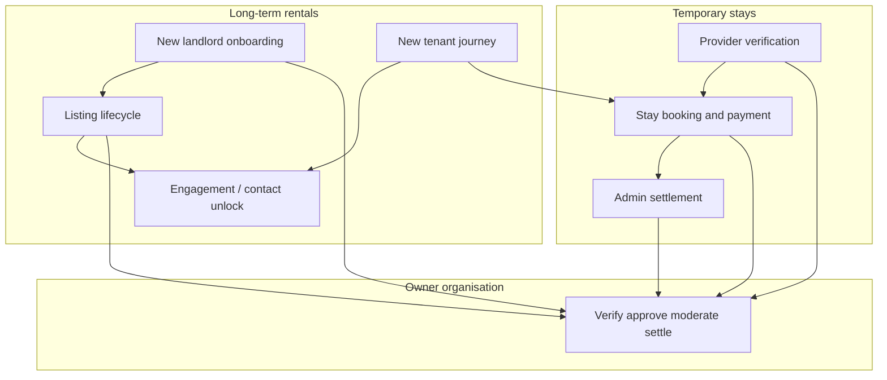
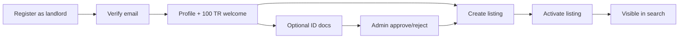
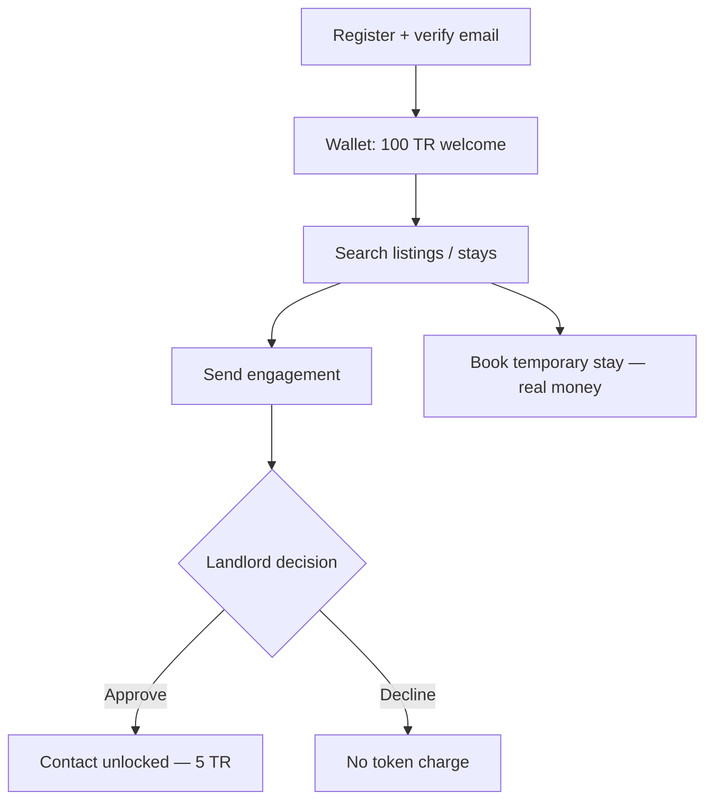
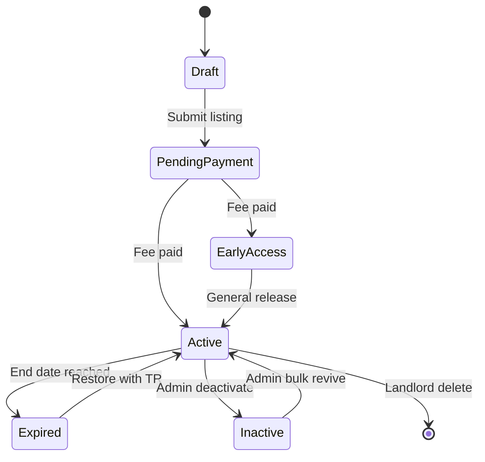
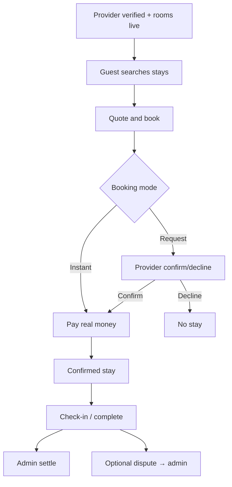

# Business Processes

| Field | Value |
| --- | --- |
| **Title** | Town Ruins Owner Pack — Business Processes |
| **Audience** | Platform owners (Hweva Tech Holdings) |
| **Version** | 1.0 |
| **Product** | [https://app.townruins.com](https://app.townruins.com) |
| **Support** | [sandbox@townruins.com](mailto:sandbox@townruins.com) |
| **Related** | [11 Daily Operations](11-Daily-Operations.md) · [06 Feature Catalogue](06-Feature-Catalogue.md) · [10 Roles and Permissions](10-Roles-and-Permissions.md) · [12 Data Ownership](12-Data-Ownership.md) |

---

## Purpose

This document describes **how the business runs** on Town Ruins version **1.0** — major journeys and decision points for owners and operators.

It is **not** a button-by-button admin manual (see [07 Admin Panel Guide](07-Admin-Panel-Guide.md) when published). Use it to train staff, explain the marketplace to colleagues, and decide who acts when something is waiting on the owner organisation.

**Two commercial rules every process assumes**

| Rule | Meaning for owners |
| --- | --- |
| **TR Tokens** | Premium platform actions (contact unlock, listing restore, and similar) use **TR Tokens** as the platform currency. Users buy tokens with money (purchase path may be demo-only in v1.0 — see [06 Feature Catalogue](06-Feature-Catalogue.md)). |
| **Temporary stay exception** | Short-term room bookings use **real money** for charges, refunds, cancellations, and related settlement — not TR Tokens. |

---

## Process map (at a glance)

| Process | Primary actors | Owner staff usually… |
| --- | --- | --- |
| New landlord | Landlord + Admin | Review identity verification when submitted |
| New tenant / guest | Tenant | Support login, tokens, and booking questions |
| Listing lifecycle | Landlord (+ Admin if inactive) | Watch expired/inactive listings; bulk revive when policy allows |
| Engagement (contact) | Tenant + Landlord | Rarely intervene; explain 5 TR on approve |
| Temporary stay booking | Tenant + Provider + Admin | Verify providers; settle completed stays; resolve disputes |
| Admin verify / moderate / settle | Admin / Super admin | Core daily operating work |

Roles and who may do what: [10 Roles and Permissions](10-Roles-and-Permissions.md). Who owns data decisions: [12 Data Ownership](12-Data-Ownership.md).

---

## 1. New landlord (onboard → list)

**Goal:** A property owner becomes a verified landlord, creates a listing, and becomes visible to tenants who search.

### Business steps

1. **Register** — The person signs up on the public site as a **landlord** (public sign-up path). Admin accounts are **not** created this way ([10 Roles](10-Roles-and-Permissions.md)).
2. **Verify email** — They open the verification link from their inbox. Unverified accounts cannot complete normal login. Resend is available if mail is delayed.
3. **Welcome TR Tokens** — On first successful email verification (or as a new Google user), the platform credits a **100 TR** welcome bonus to the wallet.
4. **Complete profile** — Username, contact details, avatar, and password as needed so tenants and support can trust the account.
5. **Identity verification documents (optional path)** — The landlord may submit ID image + selfie for identity review. Status moves: **Unverified → Pending review → Verified or Rejected**.
6. **Admin review / approve (owner step)** — Owner staff review pending landlord identity submissions and approve or reject. *v1.0 note:* document submission exists; the polished admin review screen may be **partial** — still treat the **decision** as owner-owned ([06 Feature Catalogue](06-Feature-Catalogue.md)).
7. **Create listing** — Landlord runs the listing wizard (drafts autosave). In v1.0: **one active listing per landlord**.
8. **Activate / publish** — Listing goes through payment/activation where a fee applies (`pending payment` → `active` or early-access style visibility). Photos and accurate rent/location improve quality.
9. **Live in search** — Active listings appear for tenants; landlords receive engagement requests and respond.

### Owner checkpoints

| Checkpoint | What “good” looks like |
| --- | --- |
| Email stuck | User can resend verification; support guides spam folder |
| ID pending review | Owner decides approve/reject within your internal SLA (not invented here) |
| Listing not visible | Check status (pending payment, expired, inactive, early access) before escalating to developer |
| Second listing request | Product limit: one active listing — explain; do not invent exceptions |

---

## 2. New tenant (register → search → contact → book stays)

**Goal:** A renter (or short-stay guest) can find long-term homes **and** book temporary stays.

### Business steps

1. **Register** — Public sign-up as **tenant** (email/password or Google where configured).
2. **Verify email** — Required before normal login. **100 TR** welcome bonus on first verification / new Google user.
3. **Onboarding** — Guided steps introduce the wallet and how TR Tokens work.
4. **TR Tokens** — Balance is used for premium platform actions. Contact requests are free to **send**; **5 TR** is charged only when a landlord **approves**. If balance is too low at approval time, approval fails until the tenant tops up. *Token package purchase may be demo-mode in v1.0* (no real payment for tokens until live purchase is fully wired).
5. **Search long-term listings** — Filters (location, student accommodation, amenities, rent, etc.). Saved searches can email when matches appear.
6. **Contact landlords (engagements)** — Tenant opens a listing and sends a contact request with a message. Contact details stay hidden until the landlord approves.
7. **Landlord responds** — Approve → tenant sees phone/address (and pays **5 TR**); Decline → no charge.
8. **Optional premium** — Tenant premium membership grants **early access** to new listings before general visibility.
9. **Book temporary stays** — Separate journey (section 4): search stays → book room → pay **real money** → manage under My Bookings.

### Owner checkpoints

| Situation | Owner response |
| --- | --- |
| “I never got the verification email” | Guide resend + spam; confirm production mail is working if many users fail |
| “I was charged for a contact” | Explain: charge is **on approval**, not on send; check wallet history with the user |
| “Tokens purchase didn’t charge my card” | Known v1.0 limit on token purchase path — stay honest; stay bookings remain real-money domain |
| “Landlord won’t reply” | Product does not force reply; owner may moderate listings that are spam/fraud if reported |

---

## 3. Listing lifecycle (create → active → expired / restore)

**Goal:** Long-term rental inventory stays accurate, paid-for visibility is understood, and expired stock can return with TR.

### Statuses owners care about

| Status (business meaning) | Who drives it |
| --- | --- |
| Draft | Landlord building the listing (autosave) |
| Pending payment | Created; activation fee path not finished |
| Early access | Visible to premium tenants first (where product applies) |
| Active | Fully public in search |
| Expired | Past end date — not visible; landlord may restore with TR |
| Inactive | Owner/admin deactivated for ops or policy |

### Business steps

1. **Create** — Landlord completes wizard (name, description, location, rent, rooms, amenities, images).
2. **Activate** — Pay listing fee where required; status becomes active (or early access, then broader active behaviour per product).
3. **Maintain** — Landlord edits rent, amenities, photos while active. Accuracy is the landlord’s responsibility ([12 Data Ownership](12-Data-Ownership.md)).
4. **Engage** — Tenants send contact requests; landlord approves/declines (see section 2).
5. **Expire** — When the listing reaches its end date, it leaves search.
6. **Restore with TR** — Landlord restores for a chosen number of days: **1 TR × days** (up to **30 days**). Tokens leave the landlord wallet.
7. **Admin intervention** — Owner staff may deactivate poor or policy-breaking listings, or **bulk revive** inactive/expired inventory when that is the right business call.
8. **Delete** — Landlord may permanently delete their listing (irreversible from their side).

### Engagement fee (linked process)

| Event | Token effect |
| --- | --- |
| Tenant sends contact request | **0 TR** |
| Landlord **approves** | Tenant pays **5 TR**; contact details revealed |
| Landlord **declines** | **0 TR** |
| Landlord restores listing | Landlord pays **1 TR × days** |

---

## 4. Temporary stay booking (search → pay → settle)

**Goal:** Guests book short-term rooms; providers run inventory; owners verify hosts and settle money outcomes.

This is the **real-money** path (token-economy exception).

### Business steps

1. **Provider onboarding (prerequisite)** — Host registers via **provider sign-up**, describes the business, and waits for **admin verification**. Accommodation is not fully bookable until approved (section 5).
2. **Inventory ready** — Provider configures rooms, prices, availability, booking mode (**instant** vs **request/confirm**), and policies.
3. **Guest searches** — Tenant (as guest) searches stays by location, dates, guests, price, type, and related filters.
4. **Room detail and quote** — Guest picks dates; platform shows price breakdown (and optional coupon).
5. **Book** — Guest creates a booking for the room and dates.
6. **Confirm path depends on mode**
   - **Instant:** booking moves toward payment/confirmation without a provider “accept” step.
   - **Request:** provider **confirms** or **declines** before (or as part of) the paid reservation path.
7. **Guest info + real-money payment** — Guest supplies stay details and pays via the live payment flow (e.g. EcoCash / card processors as configured). Status progresses toward **confirmed** when payment succeeds.
8. **Stay lifecycle** — Provider may check in guests; booking moves through confirmed → checked in → completed (and cancel/refund per published policy).
9. **Disputes** — Guest or provider may open a dispute; **owner staff** review and resolve/close.
10. **Admin settlement** — For completed stays with payment received, owner marks booking **settled** with a settlement reference so provider payout tracking is clear.
11. **Reviews** — After completion, guests may review; owner can publish/unpublish reviews for quality and trust.

### Owner checkpoints

| Checkpoint | Owner action |
| --- | --- |
| Unverified provider | Do not leave hosts in limbo — approve or reject with a reason |
| Unsettled completed stays | Work the bookings list; enter settlement reference |
| Payment confusion | Confirm stay domain uses real money; token wallet is unrelated to room charges |
| Dispute open | Owner decision; document resolution in admin tools |
| Commission | Owner sets provider commission rate (default commonly documented as **10%**) |

---

## 5. Admin verify, moderate, and settle (owner workflows)

**Goal:** Hweva Tech Holdings keeps the marketplace trustworthy and money outcomes clear. This is the owner’s **core operating job** on the admin dashboard (same app URL, admin credentials).

### 5.1 Landlord identity verification

| Step | Business meaning |
| --- | --- |
| 1 | Landlord submits ID + selfie |
| 2 | Status becomes **pending review** |
| 3 | Admin reviews documents (UI may be partial in v1.0) |
| 4 | **Approve** → verified; **Reject** → landlord must resubmit or operate unverified per product rules |

Owner owns the decision; developer support only if the tool is broken ([12 Data Ownership](12-Data-Ownership.md)).

### 5.2 Provider verification and commission

| Step | Business meaning |
| --- | --- |
| 1 | Provider registers via provider sign-up |
| 2 | Accommodation starts **pending** / not fully published |
| 3 | Admin **verifies** (approve) or **rejects** with notes |
| 4 | Admin sets or updates **commission rate** |
| 5 | Admin may **suspend** or **reinstate** a provider if policy requires |

> **Screenshot:** `[SCREENSHOT: admin-providers-verification]`
>
> - **Where:** Admin dashboard → Providers
> - **Shows:** Provider list with verification status and actions
> - **Capture later:** Yes — full text is complete without the image

### 5.3 Accommodation moderation

| Action | When to use |
| --- | --- |
| **Approve** | Host and property meet your standards — allowed to operate |
| **Reject** | Does not meet standards — not published |
| **Suspend** | Temporary stop after problems (safety, fraud, policy) |
| **Reinstate** | Return to normal after issue resolved |

### 5.4 Listing moderation (long-term marketplace)

| Action | When to use |
| --- | --- |
| Review inactive / expired stock | Clean marketplace or recover good inventory |
| **Bulk revive** | Business decision to restore multiple listings to active |
| Deactivate | Remove visibility for policy or quality reasons |

### 5.5 Booking settlement

| Step | Business meaning |
| --- | --- |
| 1 | Open admin bookings view |
| 2 | Identify completed stays ready for payout tracking |
| 3 | **Settle** and enter a **settlement reference** |
| 4 | Settlement status becomes **settled** with timestamp |

### 5.6 Reports, disputes, reviews, legal

| Queue | Owner outcome |
| --- | --- |
| **Reports** | Review → resolve or dismiss |
| **Disputes** | Open → under review → resolve or close with resolution text |
| **Reviews** | Publish / unpublish for public reputation control |
| **Legal documents** | Create, update, archive versions of terms, privacy, refund, community guidelines, etc. |

### 5.7 Dangerous action

**Account deletion** by admin is **irreversible** and cascades related records. Confirm identity and business intent before deleting ([10 Roles](10-Roles-and-Permissions.md)).

---

## Process ↔ feature crosswalk

| Process in this doc | Feature catalogue | Daily ops |
| --- | --- | --- |
| Landlord / tenant onboarding | Accounts, wallet welcome bonus | Morning: new registrations, verification |
| Listing lifecycle + engagements | Long-term marketplace + TR rules | Weekly: inactive listings |
| Temporary stay booking | Stays + real payments | Morning: booking requests; settle as needed |
| Admin verify / moderate / settle | Admin dashboard capabilities | All checklists in [11 Daily Operations](11-Daily-Operations.md) |

---

## What this document does not cover

| Topic | Where it lives |
| --- | --- |
| Click-by-click admin screens | [07 Admin Panel Guide](07-Admin-Panel-Guide.md) / [04 Administrator Guide](04-Administrator-Guide.md) |
| End-user how-to screenshots | [03 User Manual](03-User-Manual.md) |
| FAQ and troubleshooting | [08 FAQ](08-FAQ.md) · [09 Troubleshooting](09-Troubleshooting.md) |
| Roadmap / not-in-v1.0 items | [06 Feature Catalogue](06-Feature-Catalogue.md) known limits · [13 Release Notes](13-Release-Notes.md) |

---

## Related reading

| Need | Document |
| --- | --- |
| Day-to-day checklists | [11 Daily Operations](11-Daily-Operations.md) |
| What shipped | [06 Feature Catalogue](06-Feature-Catalogue.md) |
| Who can act | [10 Roles and Permissions](10-Roles-and-Permissions.md) |
| Who owns decisions | [12 Data Ownership](12-Data-Ownership.md) |
| First login as owner | [02 Quick Start](02-Quick-Start.md) |
