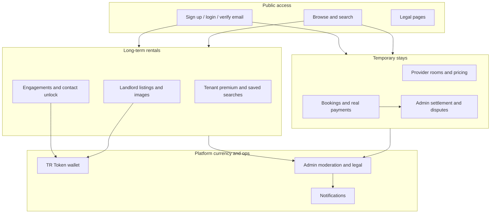

# Feature Catalogue

| Field | Value |
| --- | --- |
| **Title** | Town Ruins Owner Pack — Feature Catalogue |
| **Audience** | Platform owners (Hweva Tech Holdings) |
| **Version** | 1.0 |
| **Product** | [https://app.townruins.com](https://app.townruins.com) |
| **Support** | [sandbox@townruins.com](mailto:sandbox@townruins.com) |
| **Related** | [10 Roles and Permissions](10-roles-and-permissions) · [12 Data Ownership](12-data-ownership) · [13 Release Notes](13-release-notes) |

---

## Purpose of this catalogue

This document is the **proof-of-delivery list** for Town Ruins version **1.0**. Use it when accepting the product, briefing new owner staff, or answering “what can the platform do today?”

- Only **delivered** capabilities are listed as in scope.
- Items that are **not** part of v1.0 delivery (or are known limits) appear only in [Known limits and items not in v1.0](#known-limits-and-items-not-in-v10).
- How-to steps live in the manuals ([03](03-user-manual), [04](04-administrator-guide), [07](07-admin-panel-guide)); this catalogue is the **what**, not the full **how**.

---

## How to read the tables

| Column | Meaning |
| --- | --- |
| **Capability** | What the product does |
| **Who uses it** | Primary role(s) |
| **Owner note** | Why it matters for operators (acceptance / support) |

---

## 1. Accounts, access, and profile

| Capability | Who uses it | Owner note |
| --- | --- | --- |
| Email/password registration | Tenant, landlord (public signup) | Entry path for most users |
| Provider registration (`/provider-signup`) | Provider | Separate path for short-stay hosts |
| Admin account creation | Super admin seed / operator process | Admins are **not** created via public signup; they are seeded for your organisation |
| Email verification (required before normal login) | All public roles | Unverified accounts cannot complete normal login |
| Resend verification email | All public roles | Support path when mail is delayed or lost |
| Login (email/password) | All roles | Primary access to the live app |
| Google sign-in | Public users (where configured) | Alternative login path |
| Password reset (forgot → email link → new password) | All public roles | Standard self-service recovery |
| Profile update (username, email, avatar, password) | All signed-in users | Self-service account maintenance |
| Dark / light display mode | All users | Preference remembered in the browser |
| Post-signup onboarding (wallet introduction and guided steps) | New public users | Reduces confusion on first use |

---

## 2. Long-term rental marketplace (listings)

| Capability | Who uses it | Owner note |
| --- | --- | --- |
| Browse and search listings | Tenant (and public browse) | Core marketplace discovery |
| Listing filters (location, student accommodation, amenities, and related filters) | Tenant | Improves match quality |
| Listing detail page | Tenant / public | Shows listing content; contact details stay protected until engagement approval |
| Create listing (wizard) | Landlord | One active listing per landlord in v1.0 |
| Edit active listing | Landlord | Keep rent, amenities, and details accurate |
| Listing drafts with autosave | Landlord | Resume incomplete listings |
| Listing images (signed upload to object storage) | Landlord | Photos improve trust and response rates |
| Listing payment / activation lifecycle | Landlord | Includes pending-payment behaviour where a fee applies |
| Listing statuses (e.g. active, early access, expired, inactive, pending payment) | Landlord + Admin | Controls visibility in search |
| Restore expired listing with TR Tokens (1 TR per day, up to 30 days) | Landlord | Landlord pays tokens to restore visibility |
| Delete listing | Landlord | Permanent removal by the listing owner |
| Engagements (tenant contact request → landlord approve/decline) | Tenant + Landlord | **5 TR** charged to the **tenant** only when the landlord **approves** |
| Contact details revealed after approval | Tenant + Landlord | Privacy and safety design |
| Tenant premium membership (early access to new listings) | Tenant | Paid upgrade path for early visibility |
| Saved searches with email alerts | Tenant | Notify when new listings match criteria |
| Report a listing (and related report targets) | Users | Feeds the owner moderation queue |

---

## 3. Temporary stays (short-term accommodation)

| Capability | Who uses it | Owner note |
| --- | --- | --- |
| Provider accommodation management | Provider | Hotels, lodges, BnBs, and similar |
| Room management and availability | Provider | Inventory for bookings |
| Stay / room search and detail | Tenant (guest) | Discovery of short-term rooms |
| Booking modes (instant vs request/confirm) | Provider + Tenant | Provider configures how bookings are accepted |
| Booking payment (real money — **exception** to token-only rule) | Tenant (guest) | Stay bookings use real payment flows, not TR Tokens |
| Guest booking management (view, cancel where policy allows) | Tenant (guest) | Self-service stay history at My Bookings |
| Provider booking handling (confirm/decline, lifecycle) | Provider | Day-to-day short-stay operations |
| Booking settlement | Admin | Owner marks completed stays as settled with a reference |
| Provider verification (approve/reject) | Admin | Gate before full operation |
| Accommodation moderation (approve, reject, suspend, reinstate) | Admin | Controls what is published |
| Provider commission rate | Admin | Platform take rate per provider (default documented as 10%) |
| Provider suspend / reinstate | Admin | Stop or restore ability to take new bookings |
| Disputes on bookings | Guest / Provider raise; Admin resolves | Owner-owned resolution process |
| Guest reviews of stays; admin publish/unpublish | Guest + Admin | Public reputation control |

**Business rule (settled product invariant):** Money is used to buy **TR Tokens** for premium platform features. **Temporary stay bookings** are the exception: they use real payment processing for charges, refunds, cancellations, and related payout/settlement flows.

---

## 4. TR Tokens and wallet

| Capability | Who uses it | Owner note |
| --- | --- | --- |
| Wallet balance and transaction history | Tenant, landlord (and other wallet users) | Visible on dashboards |
| Welcome bonus (**100 TR** on first email verification / new Google user) | New users | Standard onboarding credit |
| Engagement fee (**5 TR** on approval) | Tenant pays | Core monetisation of contact unlock |
| Listing restore cost (**1 TR × days**) | Landlord pays | Visibility restoration |
| Token purchase packages (UI packages e.g. $5/50 TR, $10/100 TR, $25/300 TR) | Users | **Purchase path is demo-mode** in current product docs — no real payment processed for tokens until live payment is fully wired; treat as a known limit |
| Low-balance warning | Users | Helps avoid failed approvals |
| Admin promo token grant | Admin (via support process / technical path) | **No dedicated admin UI** in current guides — used for support corrections |

---

## 5. Notifications and communications

| Capability | Who uses it | Owner note |
| --- | --- | --- |
| In-app notifications (bell + history page) | All signed-in users | Always available |
| Email notifications | Users + Admin alerts | Depends on SMTP configuration in production |
| Push notifications (PWA / web push) | Users who enable | Requires push configuration |
| SMS channel | Configurable | Off unless SMS is enabled and configured |
| Events (engagements, listing expiry warnings, bookings, disputes, etc.) | Relevant parties | Reduces “I never got told” support load |

---

## 6. Admin dashboard and platform operations

Admin access is the **same production app**: sign in at [https://app.townruins.com](https://app.townruins.com) with admin credentials → admin dashboard.

| Capability | Who uses it | Owner note |
| --- | --- | --- |
| Admin dashboard home | Admin, Super admin | Primary operating surface for owners |
| Listing moderation (view inactive, bulk revive, deactivate) | Admin, Super admin | Keep marketplace clean and recoverable |
| Landlord identity verification review | Admin, Super admin | Backend submission exists; full review UI may be partial — operators still own the decision |
| Provider verification and commission | Admin (see [Roles](10-roles-and-permissions) for super_admin nuance) | Approve hosts before publish |
| Accommodation moderation queue | Admin, Super admin | Approve / reject / suspend / reinstate |
| View all bookings; settle bookings | Admin, Super admin | Money ops for stays |
| Dispute management (review, resolve, close) | Admin, Super admin | Owner decision authority |
| Report management (review, resolve, dismiss) | Admin, Super admin | Trust & safety |
| Review moderation (publish / unpublish) | Admin, Super admin | Content quality |
| Legal document management (create, update, archive versions) | Admin, Super admin | Terms, privacy, landlord terms, refund, community guidelines, trust & safety |
| Audit logs of admin actions | Admin, Super admin | Accountability trail |
| Feature flags (product toggles) | Operators (config) | Some features ship off until enabled |
| Account deletion (admin can delete accounts; cascading) | Admin | **Irreversible** — confirm with care |

> **Screenshot:** `[SCREENSHOT: admin-dashboard-overview]`
>
> - **Where:** Admin panel after login as admin
> - **Shows:** Main admin dashboard sections used for day-to-day ownership
> - **Capture later:** Yes — full text is complete without the image

---

## 7. Trust, legal, and public content

| Capability | Who uses it | Owner note |
| --- | --- | --- |
| Public legal pages (terms, privacy, landlord terms, refund policy, community guidelines, trust & safety) | Everyone | Owner maintains content via admin legal docs |
| Report spam / inappropriate / fraud / other | Users | Owner investigates via Reports |
| Docs hub / product guides in app | Public | Supporting product education |

---

## Capability map (at a glance)

---

## Known limits and items not in v1.0

These are **not** described as delivered product for acceptance. They appear here only so owners do not assume they shipped.

| Item | Status for v1.0 pack |
| --- | --- |
| Featured listing placement | **Not in v1.0** as a live paid feature (feature flag off / planned) |
| Premium visibility boosts | **Not in v1.0** (feature flag off / planned) |
| In-platform messaging (chat without revealing contact details) | **Not in v1.0** |
| Map-based search | **Not in v1.0** |
| Multiple active listings per landlord | **Not in v1.0** (one active listing limit) |
| Switching account type (e.g. tenant → landlord) in product | **Not in v1.0** (contact support if needed) |
| Full admin “browse all users” UI | **Not in v1.0** as a dashboard list (user ops may need DB/API support paths) |
| Admin token-grant UI | **Not in v1.0** (grant path is technical / API) |
| Real payment for **TR Token** purchases | **Known limit** — demo purchase path in product guides; stay bookings remain the real-payment domain |
| Full landlord ID verification **admin review UI** | **Partial** — submission path exists; treat full polished review UI as incomplete where guides say so |
| Phone verification as a fully enabled product path | **Not enabled by default** (feature flag / config dependent) |

Operational and engineering details of these limits belong in [13 Release Notes](13-release-notes) when published. Do not treat “planned” roadmap items as acceptance evidence.

---

## Acceptance use

When using this catalogue for formal acceptance of version **1.0**:

1. Confirm each **delivered** table row matches what you observe on [https://app.townruins.com](https://app.townruins.com) for your role.
2. Confirm known limits above match your commercial expectation (especially **token purchase demo** vs **live stay payments**).
3. Sign against the pack version and product URL in [15 Project Acceptance](15-project-acceptance) when that document is ready.

This catalogue is evidence of **what was delivered**, not a promise of future roadmap items.
