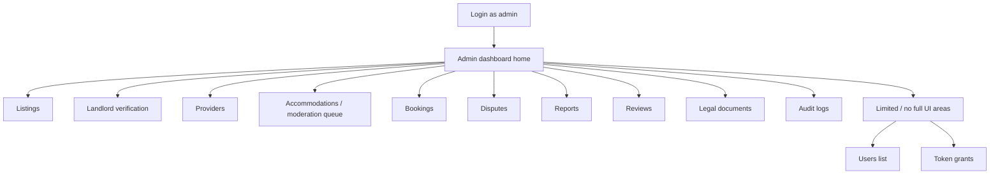

# Admin Panel Guide

| Field | Value |
| --- | --- |
| **Title** | Town Ruins Owner Pack — Admin Panel Guide |
| **Audience** | Platform owners (Hweva Tech Holdings) |
| **Version** | 1.0 |
| **Product** | [https://app.townruins.com](https://app.townruins.com) |
| **Support** | [sandbox@townruins.com](mailto:sandbox@townruins.com) |
| **Related** | [04 Administrator Guide](04-Administrator-Guide.md) · [03 User Manual](03-User-Manual.md) · [11 Daily Operations](11-Daily-Operations.md) · [06 Feature Catalogue](06-Feature-Catalogue.md) |

---

## Purpose

This is the **page-by-page operating map** of the Town Ruins **admin panel** for version **1.0**.

For each admin section you get:

- **Purpose** — why the page exists
- **What you see** — main content
- **Buttons / actions** — what you can do
- **Filters / search** — how to find items
- **Common actions** — typical owner work
- **Things to avoid** — easy mistakes

Task playbooks (when and why to settle, suspend, etc.) live in [04 Administrator Guide](04-Administrator-Guide.md). Checklists live in [11 Daily Operations](11-Daily-Operations.md).

**Entry:** [https://app.townruins.com](https://app.townruins.com) → sign in with **admin** credentials → admin dashboard (`/dashboard/admin`). No separate admin host.

---

## Panel map (v1.0)

| Section | In admin UI (v1.0) | Notes |
| --- | --- | --- |
| Dashboard home | Yes | Operating overview |
| Listings (inactive / revive) | Yes | Long-term rental moderation |
| Landlord verification | Partial | Decision still owner-owned |
| Providers | Yes | Verify, commission, suspend |
| Accommodations / queue | Yes | Approve / reject / suspend / reinstate |
| Bookings | Yes | View all; settle |
| Disputes | Yes | Review / resolve / close |
| Reports | Yes | Review / resolve / dismiss |
| Reviews | Yes | Publish / unpublish; analytics |
| Legal documents | Yes | Versioned legal CMS |
| Audit logs | Yes | Admin action history |
| Users list | **No full UI** | Documented gap |
| Token grant | **No full UI** | Technical/support path |
| Feature flags UI | **Not day-to-day owner UI** | Config / support path |
| Notifications admin console | **No dedicated ops console** | Channels are system-configured |

---

## 1. Login → Admin dashboard home

### Purpose

Sign in and reach the primary operating surface for platform owners.

### What you see

- Site login form (shared with all roles)
- After success: admin dashboard home — overview, navigation to operating sections, possibly queue counts

### Buttons / actions

| Control | Use |
| --- | --- |
| Login / Sign in | Authenticate |
| Dashboard (header) | Return to admin home if you navigated away |
| Section navigation | Open Listings, Providers, Bookings, etc. |

### Filters / search

None at the login screen. Dashboard filters live inside each section.

### Common actions

1. Sign in at start of shift.
2. Glance at overview / queue pressure.
3. Open the first busy queue (verification, reports, bookings).

### Things to avoid

- Using a **tenant** personal account to “check admin things” — it will not open admin tools.
- Sharing one admin password across staff.
- Assuming a different admin-only URL exists.

> **Screenshot:** `[SCREENSHOT: admin-panel-home]`
>
> - **Where:** `/dashboard/admin` after admin login
> - **Shows:** Admin home and main navigation
> - **Capture later:** Yes — full text is complete without the image

---

## 2. Listings (long-term rental moderation)

### Purpose

Manage long-term listing inventory visibility — especially inactive and expired stock — and restore or remove listings for policy reasons.

### What you see

- List of listings relevant to admin ops (notably **inactive** listings)
- Status indicators
- Selection controls for bulk actions
- Pagination

### Buttons / actions

| Action | Effect |
| --- | --- |
| Select listings | Prepare bulk operation |
| **Bulk Revive** | Set listings back to **active** (with new expiry as prompted) |
| Deactivate (where offered) | Move **active** → **inactive** (leaves search) |
| Open / view details | Inspect a listing before deciding |

### Filters / search

| Control | Typical use |
| --- | --- |
| Status filter | Focus inactive / expired / other statuses available in UI |
| Pagination | Move through large inventories |

### Common actions

| Goal | Steps |
| --- | --- |
| Restore good inventory | Filter inactive → select → Bulk Revive → set expiry → confirm |
| Remove policy-breaking listing | Locate listing → deactivate → resolve related report |
| Weekly health pass | Page through inactive volume; decide revive vs leave |

### Things to avoid

- Bulk reviving listings you have not sampled for quality.
- Expecting landlords to get a **second active listing** via admin revive (product limit remains **one active listing per landlord** for creation rules).
- Confusing listing restore **TR cost** (landlord-paid) with admin bulk revive (owner inventory ops).

> **Screenshot:** `[SCREENSHOT: admin-panel-listings]`
>
> - **Where:** Admin panel → Listings
> - **Shows:** Inactive listings, filters, bulk revive
> - **Capture later:** Yes — full text is complete without the image

---

## 3. Landlord verification

### Purpose

Review landlord identity document submissions (ID + selfie) and set verification outcome.

### What you see

- Pending verification items and/or status on landlord records (UI may be **partial** in v1.0)
- Document references for review
- Approve / reject outcomes

### Buttons / actions

| Action | Effect |
| --- | --- |
| **Approve** | Verification accepted; verified behaviour applies |
| **Reject** | Documents not accepted; landlord may need to resubmit |

### Filters / search

| Control | Use when available |
| --- | --- |
| Status | Pending review vs others |
| Search | Find a landlord by name/email if offered |

### Common actions

1. Process all **pending review** items in the morning pass.
2. Reject with a clear internal reason when documents fail.
3. If the UI is incomplete, still complete the **business decision** and escalate tooling blocks.

### Things to avoid

- Leaving pending reviews indefinitely without a decision.
- Approving unclear or mismatched documents under time pressure.
- Inventing a full CRM-style landlord directory if the product only exposes a partial review path.

> **Screenshot:** `[SCREENSHOT: admin-panel-landlord-verification]`
>
> - **Where:** Admin panel → Landlord verification
> - **Shows:** Pending identity review surface (may be partial)
> - **Capture later:** Yes — full text is complete without the image

---

## 4. Providers

### Purpose

Onboard short-stay hosts: verify, set commission, suspend or reinstate.

### What you see

- Provider list with verification status
- Commission rate
- Suspended / active operational state
- Search and filter controls

### Buttons / actions

| Action | Effect |
| --- | --- |
| **Approve / Verify** | Provider approved; accommodations move toward approved path; notification sent |
| **Reject** | Provider rejected; accommodations rejected path; notification sent |
| **Update commission** | Rate 0–100 applied to provider and accommodations |
| **Suspend** | Cannot accept new bookings; notification sent |
| **Reinstate** | Restored; notification sent |

### Filters / search

| Control | Use |
| --- | --- |
| Verification status filter | Find pending hosts quickly |
| Search by name / email | Support lookups |

### Common actions

| Goal | Steps |
| --- | --- |
| Onboard a host | Find pending → approve → set commission deliberately |
| Stop a bad actor | Suspend (and moderate accommodations if needed) |
| Commercial change | Update commission → confirm rate with finance |

### Things to avoid

- Approving providers without reviewing their accommodation quality path.
- Leaving commission at an accidental value after approve.
- Assuming **super_admin** can always run every provider action — keep a working **admin** account for verify/commission if needed ([10 Roles](10-Roles-and-Permissions.md)).

> **Screenshot:** `[SCREENSHOT: admin-panel-providers]`
>
> - **Where:** Admin panel → Providers
> - **Shows:** Provider list, verification and commission actions
> - **Capture later:** Yes — full text is complete without the image

---

## 5. Accommodations and moderation queue

### Purpose

Control which short-stay properties are published and bookable. The **moderation queue** surfaces items awaiting review (including accommodations pending approval).

### What you see

- Accommodations with moderation status
- Publish state (visible vs not)
- Queue of items needing attention

### Buttons / actions

| Action | Sets / effect | Notification (typical) |
| --- | --- | --- |
| **Approve** | Approved + published | Accommodation approved |
| **Reject** | Rejected + not published | Accommodation rejected |
| **Suspend** | Suspended + not published | Accommodation suspended |
| **Reinstate** | Approved + published | (may have none) |

### Filters / search

| Control | Use |
| --- | --- |
| Status / queue filters | Pending vs suspended vs approved |
| Search | Find property by name/host when available |
| Pagination | Work large queues |

### Common actions

1. Clear pending approvals before hosts complain they “cannot go live.”
2. Suspend for safety incidents; reinstate when resolved.
3. Cross-check with **Reports** when a guest flags a property.

### Things to avoid

- Approving without basic policy check (safety, legitimacy).
- Suspending without a note in your ops process (harder to reinstate fairly later).
- Confusing **provider** suspend with **accommodation** suspend — both exist; use the level that matches the problem.

> **Screenshot:** `[SCREENSHOT: admin-panel-accommodations]`
>
> - **Where:** Admin panel → Accommodations / Moderation queue
> - **Shows:** Pending accommodations and moderation actions
> - **Capture later:** Yes — full text is complete without the image

---

## 6. Bookings

### Purpose

See **all** temporary stay bookings across the platform and **settle** completed stays for payout tracking.

### What you see

- Platform-wide booking list
- Statuses (pending confirmation, pending payment, confirmed, completed, cancelled, etc.)
- Settlement status
- Booking detail fields needed for support

### Buttons / actions

| Action | Effect |
| --- | --- |
| Open booking | Inspect guest, host, dates, payment/settlement state |
| **Settle** | Mark settled; requires **settlement reference**; records settled time |
| Ops cancel / override | Only if product exposes it — do not invent |

### Filters / search

| Control | Use |
| --- | --- |
| Status | Find completed unsettled stays |
| Search | Booking id, guest, property if offered |
| Date / pagination | Finance period reviews |

### Common actions

| Goal | Steps |
| --- | --- |
| Daily settlement pass | Filter completed → settle with unique reference |
| Support “where is my booking?” | Search → confirm status → explain real-money path |
| Dispute prep | Open booking context before resolving dispute |

### Things to avoid

- Settling without a reconcilable reference.
- Telling users that **TR Tokens** pay for rooms.
- Expecting a full banking payout dashboard inside this list — settlement is owner-marked tracking in product terms.

> **Screenshot:** `[SCREENSHOT: admin-panel-bookings]`
>
> - **Where:** Admin panel → Bookings
> - **Shows:** Booking list and settle action
> - **Capture later:** Yes — full text is complete without the image

---

## 7. Disputes

### Purpose

Owner-managed resolution of booking conflicts raised by guests or providers.

### What you see

- Dispute list with status (open, under review, resolved, closed)
- Raised-by user and role
- Reason and description
- Resolution text and resolver metadata when completed

### Buttons / actions

| Action | Effect |
| --- | --- |
| **Review** | Status → under review |
| **Resolve** | Requires resolution text; notifies parties (resolved) |
| **Close** | Close without formal resolve path when appropriate |

### Filters / search

| Control | Use |
| --- | --- |
| Status | Open vs under review backlog |
| Search | Find by booking/user when available |

### Common actions

1. Mark open items under review the same day they arrive when possible.
2. Write a clear resolution.
3. Link outcome to any settlement or refund policy decisions outside pure text.

### Things to avoid

- Resolving with empty text.
- Leaving disputes open for long periods without status change.
- Taking sides without reading both the dispute description and booking state.

> **Screenshot:** `[SCREENSHOT: admin-panel-disputes]`
>
> - **Where:** Admin panel → Disputes
> - **Shows:** Dispute queue and review/resolve controls
> - **Capture later:** Yes — full text is complete without the image

---

## 8. Reports

### Purpose

Trust & safety queue for user-submitted reports about listings, accommodations, or reviews.

### What you see

- Report list with reason (spam, inappropriate, fraud, other)
- Target type and target reference
- Status (open, under review, resolved, dismissed)

### Buttons / actions

| Action | Effect |
| --- | --- |
| **Review** | Under review |
| **Resolve** | Close with resolution note; reporter may be notified |
| **Dismiss** | Unfounded or duplicate |

### Filters / search

| Control | Use |
| --- | --- |
| Status | Work open backlog |
| Target type | Focus listings vs stays vs reviews |
| Search | Locate report by subject when available |

### Common actions

1. Review → inspect target in Listings / Accommodations / Reviews.
2. Take content action (deactivate, suspend, unpublish).
3. Resolve or dismiss with a short note.

### Things to avoid

- Resolving a report without checking the target content.
- Dismissing fraud claims without a look.
- Forgetting to deactivate a listing you agreed was abusive.

> **Screenshot:** `[SCREENSHOT: admin-panel-reports]`
>
> - **Where:** Admin panel → Reports
> - **Shows:** Report queue and resolve/dismiss actions
> - **Capture later:** Yes — full text is complete without the image

---

## 9. Reviews

### Purpose

Moderate public guest reviews of stays and view basic review analytics.

### What you see

- Review list with publish state
- Ratings and related accommodation
- Analytics: average overall rating, counts by 1–5 stars, breakdown by accommodation (where shown)

### Buttons / actions

| Action | Effect |
| --- | --- |
| **Publish** | Visible to public |
| **Unpublish** | Hidden from public |

### Filters / search

| Control | Use |
| --- | --- |
| Published / unpublished | Find hidden or live reviews |
| Accommodation filter | Host reputation checks |
| Search | Locate a review in a dispute |

### Common actions

| Goal | Steps |
| --- | --- |
| Abuse takedown | Find review → Unpublish |
| Restore fair review | Publish if previously hidden in error |
| Monthly quality sample | Scan published reviews for patterns |

### Things to avoid

- Unpublishing solely because a host dislikes a fair low rating (policy decision — document your standard).
- Ignoring review analytics if disputes about quality spike.

> **Screenshot:** `[SCREENSHOT: admin-panel-reviews]`
>
> - **Where:** Admin panel → Reviews
> - **Shows:** Review list, publish controls, analytics summary
> - **Capture later:** Yes — full text is complete without the image

---

## 10. Legal documents

### Purpose

Manage versioned public legal content (terms, privacy, landlord terms, refund, community guidelines, trust & safety).

### What you see

- Document list by title/slug
- Active version indicator
- Create / update / archive controls

### Buttons / actions

| Action | Effect |
| --- | --- |
| **Create** | New document at version 1 |
| **Update** | New version; previous archived |
| **Archive** | Inactive — no longer served as public active version |
| **Delete** (if shown) | Use only with extreme care — prefer archive |

### Filters / search

Usually by document title/slug rather than complex filters.

### Common actions

1. Update refund or community wording when ownership/counsel requires it.
2. Confirm public URLs still show the active version after update.
3. Keep an offline record of why a version changed.

### Things to avoid

- Casual edits to contractual language.
- Leaving no active document for a required policy page.
- Confusing this CMS with marketing blog content.

> **Screenshot:** `[SCREENSHOT: admin-panel-legal-docs]`
>
> - **Where:** Admin panel → Legal documents (`/admin/legal-docs` style path)
> - **Shows:** Legal document list and version management
> - **Capture later:** Yes — full text is complete without the image

---

## 11. Audit logs

### Purpose

Accountability trail of admin actions (who did what, to which target, when).

### What you see

- Chronological log entries
- Admin identity, action name, target type/id
- Optional metadata and timing

### Buttons / actions

| Action | Effect |
| --- | --- |
| View / refresh list | Inspect recent activity |
| Filter (if available) | Narrow by admin, action, or date |

There is typically **no “edit log”** — treat entries as read-only history.

### Filters / search

| Control | Use |
| --- | --- |
| Date range | Monthly compliance review |
| Admin id | Investigate a staff action |
| Action / target | Trace a specific settle or approve |

### Common actions

1. After a sensitive change, confirm the audit entry exists.
2. Monthly sample for unexpected actions.
3. Investigate “who suspended this host?”

### Things to avoid

- Expecting automatic purge/retention UI — define retention offline.
- Using audit logs as a substitute for finance settlement records.

> **Screenshot:** `[SCREENSHOT: admin-panel-audit-logs]`
>
> - **Where:** Admin panel → Audit logs
> - **Shows:** Admin action history table
> - **Capture later:** Yes — full text is complete without the image

---

## 12. Notifications (awareness — not a full admin console)

### Purpose (for owners)

Understand how users get notified so you can support “I never got an email” tickets. There is **no dedicated day-to-day notification operations console** described as a full admin page in v1.0 owner surfaces.

### Channels

| Channel | Owner note |
| --- | --- |
| Email | Depends on production mail setup |
| In-app | Always available when signed in |
| Push | Requires configuration; user permission |
| SMS | Off unless enabled |

### Common actions

- Guide users to in-app notification history and spam folders.
- Escalate **platform-wide** delivery failures to [sandbox@townruins.com](mailto:sandbox@townruins.com).

### Things to avoid

- Treating one user’s spam filtering as a platform outage.
- Expecting an admin “resend all emails” control if not present.

> **Screenshot:** `[SCREENSHOT: admin-panel-notifications-context]`
>
> - **Where:** In-app notification bell (user or admin session)
> - **Shows:** Notification entry point users refer to
> - **Capture later:** Yes — full text is complete without the image

---

## 13. Wallet and TR Tokens (limited admin surface)

### Purpose

Token economy is mostly **user-facing**. Admin **promo grants** exist as a capability in product guides but **without a dedicated grant UI** in v1.0.

### What you will not find

- A polished “grant tokens” form on the admin dashboard (as documented)

### What owners do instead

| Need | Path |
| --- | --- |
| Explain balances and fees | Use [03 User Manual](03-User-Manual.md) and [05 Business Processes](05-Business-Processes.md) |
| Correct a genuine error with a promo grant | Contact [sandbox@townruins.com](mailto:sandbox@townruins.com) / developer under full-time contract |
| Token purchase complaints | Be honest about **demo-mode** purchase path if still demo |

### Things to avoid

- Inventing a grant button in training materials.
- Promising real payment for token packages if purchase is demo-only.

> **Screenshot:** `[SCREENSHOT: admin-panel-tokens-gap]`
>
> - **Where:** N/A — no dedicated token grant UI
> - **Shows:** Placeholder for future grant UI if product adds it
> - **Capture later:** Yes — full text is complete without the image

---

## 14. Users (no full list UI)

### Purpose (gap documentation)

Admin power includes high-impact user operations (including account deletion), but version **1.0** does **not** deliver a full “browse all users” admin list UI.

### What you will not find

- A complete user directory with filters like a CRM

### What owners do instead

| Need | Path |
| --- | --- |
| Login help | Self-service verify + password reset coaching |
| Bad content | Listings / providers / accommodations / reports |
| Account deletion | Elevated admin capability — only with confirmed intent; may require support path if no screen is exposed |
| Data extract | Support under contract |

### Things to avoid

- Telling staff to “open Users and suspend” as if a full UI exists.
- Deleting accounts casually.

> **Screenshot:** `[SCREENSHOT: admin-panel-users-gap]`
>
> - **Where:** N/A — no dedicated users list in v1.0 admin UI
> - **Shows:** Placeholder for future user management UI
> - **Capture later:** Yes — full text is complete without the image

---

## 15. Feature flags and system configuration (not primary admin pages)

### Purpose

Some product behaviours are controlled by **feature flags** and environment configuration (featured listings, premium boosts, phone verification UI, SMS, payment provider, etc.).

### Owner reality in v1.0

| Item | In admin panel? | Owner action |
| --- | --- | --- |
| Toggle featured listings / boosts in a settings page | Not a day-to-day owner UI in pack sources | Treat off flags as not live acceptance features; request changes via support if needed |
| Payment provider keys | No | Technical operators / developer |
| SMS / push keys | No | Technical operators / developer |

### Things to avoid

- Presenting flagged-off features as shipped.
- Running server environment changes as a routine admin checklist item.

---

## 16. Profile, display mode, and logout

### Purpose

Personal account maintenance for the signed-in admin.

### Buttons / actions

| Action | Effect |
| --- | --- |
| Edit profile | Update username, email, avatar, password as product allows |
| Dark / light mode | Display preference in browser |
| Log out | End session |

### Common actions

- Change temporary passwords after provisioning.
- Log out on shared machines.

### Things to avoid

- Editing legal docs from “profile” by mistake (use Legal documents section).
- Leaving admin sessions open unattended.

> **Screenshot:** `[SCREENSHOT: admin-panel-profile-logout]`
>
> - **Where:** Header account menu
> - **Shows:** Profile and logout controls
> - **Capture later:** Yes — full text is complete without the image

---

## Quick reference: actions by goal

| I need to… | Go to |
| --- | --- |
| See today’s pressure | Dashboard home |
| Restore expired/inactive rentals | Listings → Bulk Revive |
| Approve a short-stay host | Providers |
| Publish a property | Accommodations / queue → Approve |
| Pay out tracking for a stay | Bookings → Settle |
| End a guest/host conflict | Disputes |
| Act on spam/fraud flag | Reports (+ content section) |
| Hide abusive review | Reviews → Unpublish |
| Change terms/privacy | Legal documents |
| See who approved something | Audit logs |
| Grant TR tokens | Support under contract (no full UI) |
| Browse all users | Not in v1.0 UI — support path |

---

## Related reading

| Need | Document |
| --- | --- |
| Task playbooks | [04 Administrator Guide](04-Administrator-Guide.md) |
| Broader orientation | [03 User Manual](03-User-Manual.md) |
| Morning/weekly cadence | [11 Daily Operations](11-Daily-Operations.md) |
| What shipped | [06 Feature Catalogue](06-Feature-Catalogue.md) |
| Roles | [10 Roles and Permissions](10-Roles-and-Permissions.md) |

---

*Town Ruins Owner Pack v1.0 · Admin Panel Guide · Hweva Tech Holdings*
