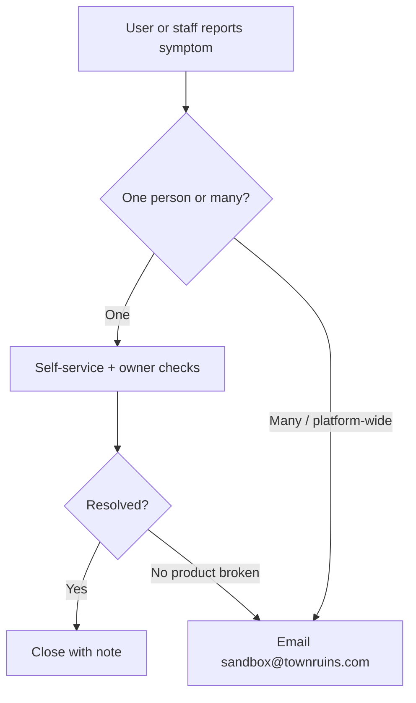

# Troubleshooting

| Field | Value |
| --- | --- |
| **Title** | Town Ruins Owner Pack — Troubleshooting |
| **Audience** | Platform owners (Hweva Tech Holdings) |
| **Version** | 1.0 |
| **Product** | [https://app.townruins.com](https://app.townruins.com) |
| **Support** | [sandbox@townruins.com](mailto:sandbox@townruins.com) |
| **Related** | [08 FAQ](08-faq) · [03 User Manual](03-user-manual) · [04 Administrator Guide](04-administrator-guide) · [11 Daily Operations](11-daily-operations) · [14 Support and Warranty](14-support-and-warranty) |

---

## Purpose

Non-technical **symptom → checks → next action** for owner staff.

- No servers, logs, databases, or deployment steps.
- Fix routine user and ops issues yourselves.
- Escalate when the **product is broken** (many users affected, tools fail for everyone) to [sandbox@townruins.com](mailto:sandbox@townruins.com).
- Warranty and response expectations: **per full-time contract**.

---

## How to use this guide

For each issue below:

1. Confirm the **symptom** in the user’s words.
2. Work the **checks** in order.
3. Take the **next action**.
4. If still stuck and it looks like a defect, email support with: what failed, who is affected (one vs many), account email (if appropriate), approximate time, and what you already tried.

---

## Cannot log in

| | |
| --- | --- |
| **Symptom** | “Wrong password,” blank after submit, or “cannot access account.” |

**Checks**

1. Confirm the **exact email** used at registration (typos are common).
2. Confirm **password** carefully; Caps Lock off.
3. For public roles: is **email verified**? Ask them to check inbox + spam for verification; use **resend verification** if available.
4. Confirm method: **email/password** vs **Google** — use the same method as sign-up.
5. For admin staff: confirm they use **admin** credentials issued for ownership, not a personal tenant account.
6. Ask: is this **one person** or **many people right now**?

**Next action**

| Result | Do this |
| --- | --- |
| Unverified email | Guide verification / resend + spam check |
| Forgotten password | **Forgot password** self-service |
| One user still stuck after reset | Walk through reset again; confirm correct email |
| Admin staff cannot get in after self-service fails | [sandbox@townruins.com](mailto:sandbox@townruins.com) for controlled reset under contract |
| Many users cannot log in | Escalate immediately as product/mail incident |

---

## Password reset email never arrives

| | |
| --- | --- |
| **Symptom** | User requested reset but no email. |

**Checks**

1. Spam / promotions / junk folders.
2. Correct email address on the request form.
3. Wait a few minutes and try **one** resend (avoid spamming the form).
4. In-app path still available? (Some users can still use Google if that was their method.)
5. One user vs many users failing mail at the same time.

**Next action**

| Result | Do this |
| --- | --- |
| Found in spam | Complete reset; remind to whitelist the sender |
| One-off delay | Retry once; document time |
| Platform-wide no mail | Escalate to [sandbox@townruins.com](mailto:sandbox@townruins.com) |

---

## Images will not upload

| | |
| --- | --- |
| **Symptom** | Landlord or provider cannot add listing / room photos. |

**Checks**

1. Are they **signed in** as the correct role (landlord or provider)?
2. File type and size — use common image formats; avoid huge files if the product rejects them.
3. Stable network; try another browser or device.
4. Is the listing / room still in a state that allows edits (not fully locked by payment/status)?
5. One uploader vs **everyone** failing uploads.

**Next action**

| Result | Do this |
| --- | --- |
| User error (format, session, role) | Guide correct account and retry |
| One listing stuck but others work | Note listing ID/name; retry edit flow |
| All uploads fail across users | Escalate — likely storage/configuration defect → [sandbox@townruins.com](mailto:sandbox@townruins.com) |

Owners do not reconfigure storage. User-supplied images remain the uploader’s responsibility for content rights and quality.

---

## Tenant cannot contact landlord

| | |
| --- | --- |
| **Symptom** | “No phone/email on listing” or “contact button does nothing.” |

**Checks**

1. Did the tenant send an **engagement** (contact request)?
2. What is the engagement status — **pending**, **approved**, or **declined**?
3. If approved: does the tenant have enough **TR balance** for the **5 TR** charge that applies on approval?
4. Is the user expecting **in-app chat**? That is **not in v1.0**.
5. Is the listing still **active** / visible?

**Next action**

| Result | Do this |
| --- | --- |
| Pending approval | Explain: landlord must approve; contact details unlock only then |
| Declined | Explain decline; tenant may try other listings |
| Insufficient TR | Guide wallet / token purchase path; be honest if purchase is **demo-mode** in v1.0 |
| Expects chat | Explain design: contact unlock after approval, not live chat |
| Approval works for others but this user always fails | Escalate if product charge/unlock looks broken |

**Rule to quote:** Send is free. **5 TR is charged to the tenant only when the landlord approves.**

---

## Booking stuck (temporary stays)

| | |
| --- | --- |
| **Symptom** | Guest or provider says booking will not progress / pay / confirm. |

**Checks**

1. Confirm this is a **stay booking** (real money), not a long-term engagement or token package.
2. In admin **Bookings**, open the booking and note status (e.g. pending confirmation, pending payment, confirmed, cancelled, disputed).
3. **Instant** vs **request** mode: request-mode needs provider confirm/decline.
4. Has the guest completed payment when the status expects it?
5. Is there an open **dispute**?
6. One booking vs many stuck payments across guests.

**Next action**

| Result | Do this |
| --- | --- |
| Awaiting provider | Provider confirms/declines; coach host if needed |
| Awaiting guest payment | Guest completes payment; do not “settle” unpaid incomplete stays |
| Completed stay awaiting finance | **Settle** with a clear settlement reference when policy says so |
| Dispute open | Resolve via **Disputes** (owner decision) |
| Payment path broken for many guests | Escalate to [sandbox@townruins.com](mailto:sandbox@townruins.com) |

Do not confuse **TR Token** balances with **stay payment** status.

---

## Verification stuck (landlord or provider)

| | |
| --- | --- |
| **Symptom** | “Submitted documents days ago; still not verified.” |

**Checks**

1. Role: **landlord identity** vs **provider** verification (different admin areas).
2. Status: unverified / pending / approved / rejected.
3. Did owner staff already reject? User may need to **resubmit**.
4. For landlords: is the review surface available? (UI may be **partial** in v1.0 — decision still yours.)
5. For providers: try with a designated **admin** account if **super_admin** cannot complete verify/commission.

**Next action**

| Result | Do this |
| --- | --- |
| Pending in queue | Owner reviews and approve/reject this working day if possible |
| Rejected | Communicate reason; guide resubmit |
| Tooling empty or errors for all pending items | Escalate under contract — do not invent a review screen |
| Business decision unclear | Leadership call inside Hweva Tech Holdings — not a developer decision |

---

## Listing not visible in search

| | |
| --- | --- |
| **Symptom** | Landlord: “My property does not show up.” |

**Checks**

1. Listing status: draft, pending payment, early access, active, expired, inactive.
2. Was it **deactivated** by admin for policy?
3. Expired? Restore path: landlord **TR restore** (1 TR × days, up to 30) and/or admin **bulk revive** when appropriate.
4. v1.0 limit: only **one active listing** per landlord — second listing will not run as a second active.
5. Filters on tenant search (location, amenities) that hide the property.

**Next action**

| Result | Do this |
| --- | --- |
| Pending payment / draft | Landlord completes listing activation path |
| Expired / inactive | Restore or revive per policy |
| Deactivated for policy | Resolve reports / quality first; then revive only if safe |
| Wants second active listing | Explain product limit; do not invent exceptions |

---

## “I was charged 5 TR but never messaged”

| | |
| --- | --- |
| **Symptom** | Tenant disputes wallet debit. |

**Checks**

1. Engagement history: was a request **approved** by the landlord?
2. Wallet **transaction history** for 5 TR engagement fee.
3. Clarify: charge is on **approval**, not on sending the request.

**Next action**

| Result | Do this |
| --- | --- |
| Approval happened | Explain standard fee; contact details should unlock |
| No approval but debit appears | Escalate as possible ledger defect |
| Wants refund of TR | Owner business decision; technical adjust may need support (no grant UI in v1.0) |

---

## Token purchase / welcome bonus issues

| | |
| --- | --- |
| **Symptom** | “Card not charged,” “no tokens after package,” or “no welcome 100 TR.” |

**Checks**

1. Welcome bonus: did user complete **email verification** (or new Google user path)?
2. Package purchase: is the path still **demo-mode** in v1.0? Be honest if no real payment is processed for tokens yet.
3. Wallet history for credits/debits.
4. One user vs all token purchases failing.

**Next action**

| Result | Do this |
| --- | --- |
| Not verified | Complete verification; welcome credit should follow product rules |
| Demo purchase expected | Explain known limit; stay bookings are the real-money path |
| Real charge claimed but no tokens / ledger wrong | Escalate with time and account details |

---

## Provider cannot take bookings

| | |
| --- | --- |
| **Symptom** | Host says guests cannot book rooms. |

**Checks**

1. Provider **verification** status (approved?).
2. Accommodation **moderation** status (approved vs rejected/suspended).
3. Provider **suspended** by admin?
4. Rooms / availability configured?
5. Booking mode (instant vs request) understood by host?

**Next action**

| Result | Do this |
| --- | --- |
| Unverified / unapproved property | Complete verify + accommodation approve path |
| Suspended | Reinstate only if policy allows |
| Inventory empty | Host adds rooms/availability |
| Product errors for all hosts | Escalate |

---

## Admin cannot find a “users list” or “grant tokens” button

| | |
| --- | --- |
| **Symptom** | Staff expect CRM-style user directory or token grant screen. |

**Checks**

1. Confirm version **1.0** known limits in [06 Feature Catalogue](06-feature-catalogue).
2. Use related surfaces: bookings, listings, reports, disputes — not a global user grid.
3. For promo TR: no dedicated admin UI — use support/technical path under contract.

**Next action**

| Result | Do this |
| --- | --- |
| Expected missing UI | Explain known limit; do not invent screens |
| Need extract or grant | Email [sandbox@townruins.com](mailto:sandbox@townruins.com) with business reason |

---

## When to escalate (summary)

Email **[sandbox@townruins.com](mailto:sandbox@townruins.com)** when:

| Escalate | Do not escalate first |
| --- | --- |
| Login/mail/upload/payment broken for **many** users | One forgotten password |
| Admin tooling errors blocking **all** verification or settlement | One difficult approve/reject business call |
| Ledger shows impossible token/money state after checks | User does not like a correct 5 TR charge |
| New staff admin account needed via provision process | User wants a second active listing (product limit) |

Include: symptom, scope (one vs many), when it started, accounts/listings/bookings involved, and checks already tried.

Warranty coverage and response expectations remain **per full-time contract** — see [14 Support and Warranty](14-support-and-warranty).
