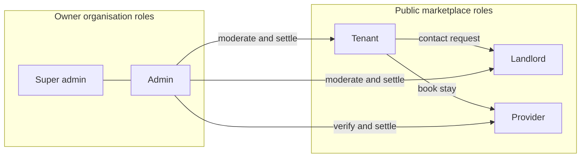

# Roles and Permissions

| Field | Value |
| --- | --- |
| **Title** | Town Ruins Owner Pack — Roles and Permissions |
| **Audience** | Platform owners (Hweva Tech Holdings) |
| **Version** | 1.0 |
| **Product** | [https://app.townruins.com](https://app.townruins.com) |
| **Support** | [sandbox@townruins.com](mailto:sandbox@townruins.com) |
| **Related** | [06 Feature Catalogue](06-feature-catalogue) · [12 Data Ownership](12-data-ownership) · [07 Admin Panel Guide](07-admin-panel-guide) |

---

## Why this document exists

Town Ruins is a multi-role platform. Owners need a clear picture of **who can do what** so that:

- Staff accounts are created with the right level of power
- Support answers match what each role is allowed to see
- Day-to-day moderation and money decisions stay with the owner organisation

This is a **plain-language** matrix for operators. It is not an API permission table.

---

## Roles at a glance

| Role (product name) | Internal name | How the account is created | Home after login |
| --- | --- | --- | --- |
| Tenant (guest for stays) | `tenant` | Public sign-up | Tenant dashboard |
| Landlord | `landlord` | Public sign-up as landlord | Landlord dashboard |
| Provider | `provider` | Provider sign-up flow | Provider dashboard |
| Administrator | `admin` | Seeded / created by operators — **not** public sign-up | Admin dashboard |
| Super Administrator | `super_admin` | Seeded (e.g. super-admin seed script) — **not** public sign-up | Admin dashboard |

**Owner organisation staff** who run the platform day to day should use **admin** or **super_admin** accounts. Do not run the platform as a personal tenant account.

---

## Role map

---

## Permission matrix (what each role can do)

Legend: **Yes** = intended capability · **No** = not available to that role · **Limited** = partial or support-path only

### Accounts and access

| Action | Tenant | Landlord | Provider | Admin | Super admin |
| --- | --- | --- | --- | --- | --- |
| Register via public sign-up | Yes | Yes | Via provider sign-up | No | No |
| Verify email / log in | Yes | Yes | Yes | Yes | Yes |
| Reset password | Yes | Yes | Yes | Yes | Yes |
| Edit own profile | Yes | Yes | Yes | Yes | Yes |
| Access admin dashboard | No | No | No | Yes | Yes |
| Create other admin accounts via public UI | No | No | No | No | No (seed / controlled process) |

### Long-term listings marketplace

| Action | Tenant | Landlord | Provider | Admin | Super admin |
| --- | --- | --- | --- | --- | --- |
| Search and view listings | Yes | Browse | Browse | Yes (ops) | Yes (ops) |
| Create / edit / delete **own** listing | No | Yes | No | No | No |
| One active listing limit | — | Applies | — | — | — |
| Restore expired listing with TR | No | Yes | No | No | No |
| Send engagement (contact request) | Yes | No | No | No | No |
| Approve / decline engagements | No | Yes | No | No | No |
| Pay 5 TR on engagement approval | Yes (tenant pays) | No | No | No | No |
| Premium membership / early access | Yes | No | No | No | No |
| Saved searches and alerts | Yes | No | No | No | No |
| Bulk revive / deactivate listings | No | No | No | Yes | Yes |
| Review landlord identity verification | No | Submit docs | No | Yes | Yes |

### Temporary stays

| Action | Tenant | Landlord | Provider | Admin | Super admin |
| --- | --- | --- | --- | --- | --- |
| Search and book stays | Yes | No* | No* | Ops view | Ops view |
| Manage accommodation and rooms | No | No | Yes | Moderate | Moderate |
| Confirm / decline request bookings | No | No | Yes | Override via ops | Override via ops |
| Cancel own booking (per policy) | Yes | No | Per product rules | Yes (ops) | Yes (ops) |
| Verify provider / set commission | No | No | No | Yes | See note below |
| Suspend / reinstate provider | No | No | No | Yes | Yes |
| Approve / reject / suspend accommodations | No | No | No | Yes | Yes |
| Settle bookings | No | No | No | Yes | Yes |
| Raise booking dispute | Yes (guest) | No | Yes | Manage | Manage |
| Resolve / close disputes | No | No | No | Yes | Yes |

\*Landlords and providers may still browse public stay pages as ordinary visitors when logged out or if product allows browse; they do not use the guest booking role as their primary job.

### TR Tokens, payments, reports, legal

| Action | Tenant | Landlord | Provider | Admin | Super admin |
| --- | --- | --- | --- | --- | --- |
| View own wallet and history | Yes | Yes | As product allows | Ops | Ops |
| Buy TR packages (demo path in v1.0 docs) | Yes | Yes | As product allows | No UI focus | No UI focus |
| Grant promo TR tokens | No | No | No | Limited (no full UI) | Limited (no full UI) |
| Pay real money for **stay** bookings | Yes | No | Receives via settlement path | Settle | Settle |
| Report listing / accommodation / review | Yes | Yes | Yes | Review reports | Review reports |
| Publish / unpublish reviews | No | No | No | Yes | Yes |
| Manage legal document versions | No | No | No | Yes | Yes |
| View audit logs | No | No | No | Yes | Yes |
| Delete user accounts (cascading) | Own account flows only | Own account flows only | Own account flows only | Yes (any) | Yes (any) |

---

## Admin vs Super admin (plain language)

For day-to-day ownership, **both** `admin` and `super_admin` use the **same admin dashboard** and share the same broad operating powers (moderation, bookings, disputes, reports, legal docs, audit).

| Point | What owners should know |
| --- | --- |
| UI distinction | Product guides describe **no meaningful separate super-admin UI** in the current version |
| Dashboard access | Both roles open `/dashboard/admin` after login |
| Practical difference | Both are owner-organisation operator roles; treat them as trusted staff accounts |
| Technical nuance | A small number of provider management actions have historically been restricted to the exact `admin` role only (verify provider / commission). If a super-admin account cannot complete a provider verify or commission update, use a designated `admin` account or ask support under the contract |

**Recommendation for Hweva Tech Holdings:** Keep at least one working `admin` account for full provider verification/commission actions, and use `super_admin` as a seeded break-glass / primary operator account as you prefer — but test both after go-live.

---

## What each role is for (operating summary)

| Role | Purpose on the platform | Owner staff care about… |
| --- | --- | --- |
| **Tenant** | Find long-term rentals; book temporary stays; spend TR on contact unlock | Login/verification issues, missing tokens, booking problems |
| **Landlord** | List one active long-term property; respond to contact requests | Listing not visible, restore costs, verification status |
| **Provider** | Run short-stay inventory and bookings | Verification, accommodation approval, payouts/settlement questions |
| **Admin** | Operate the marketplace on behalf of the owner | Daily queues: providers, accommodations, listings, reports, disputes, settlement |
| **Super admin** | Same operator surface as admin (see nuance above) | Same queues; treat as highly trusted |

---

## Security expectations for owner roles

- **Never share** admin credentials between people. One person, one account — audit logs must show who acted.
- Admin accounts are **not** created through public registration. Use the controlled seed / provisioning process.
- Prefer the **admin panel** for owner work; do not ask the developer to perform routine moderation or settlement that your staff can do in-product.
- Account deletion is **irreversible** and cascades across listings, bookings, and related records — confirm identity and intent before deleting.

> **Screenshot:** `[SCREENSHOT: admin-role-dashboard-entry]`
>
> - **Where:** Header → Dashboard after signing in as admin
> - **Shows:** Admin dashboard entry (gold dashboard affordance / redirect after login)
> - **Capture later:** Yes — full text is complete without the image

---

## Related reading

| Need | Document |
| --- | --- |
| What shipped for each role | [06 Feature Catalogue](06-feature-catalogue) |
| Who owns which data decisions | [12 Data Ownership](12-data-ownership) |
| How to use the admin UI day to day | [07 Admin Panel Guide](07-admin-panel-guide) · [11 Daily Operations](11-daily-operations) |
