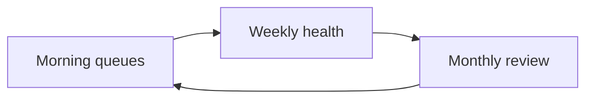

# Daily Operations

| Field | Value |
| --- | --- |
| **Title** | Town Ruins Owner Pack — Daily Operations |
| **Audience** | Platform owners (Hweva Tech Holdings) |
| **Version** | 1.0 |
| **Product** | [https://app.townruins.com](https://app.townruins.com) |
| **Support** | [sandbox@townruins.com](mailto:sandbox@townruins.com) |
| **Related** | [05 Business Processes](05-business-processes) · [02 Quick Start](02-quick-start) · [06 Feature Catalogue](06-feature-catalogue) · [10 Roles and Permissions](10-roles-and-permissions) |

---

## Purpose

Concrete **checklists** for owner staff who run Town Ruins day to day. Use these so nothing important sits unreviewed in the admin panel.

- **Audience:** Admin / super admin operators at Hweva Tech Holdings
- **Surface:** [https://app.townruins.com](https://app.townruins.com) signed in with **admin** credentials (same app — no separate admin website)
- **Depth:** What to check and decide — not every click (button-level UI belongs in [07 Admin Panel Guide](07-admin-panel-guide) when published)
- **Process context:** Why each queue exists is in [05 Business Processes](05-business-processes)

**Rule of thumb:** You own routine verification, moderation, settlement, reports, and disputes. Escalate to [sandbox@townruins.com](mailto:sandbox@townruins.com) when the **product is broken**, not when a business decision is merely hard.

---

## How to use these checklists

| Cadence | Timebox (guide) | Focus |
| --- | --- | --- |
| **Morning** | 15–30 minutes | Queues that block users (verification, bookings, reports) |
| **Weekly** | 30–60 minutes | Health of inventory, support backlog, patterns |
| **Monthly** | 45–90 minutes | Growth, exports, commercial review of platform usage |

Tick items in your own ops notes or shared staff sheet. Adapt times to volume after go-live.

---

## Morning checklist

Do this at the start of the operating day (or each shift if you staff in shifts).

### 1. Open the admin surface

| # | Action | Done when |
| --- | --- | --- |
| 1.1 | Open [https://app.townruins.com](https://app.townruins.com) | Site loads |
| 1.2 | Sign in with **your** admin account (not a shared personal tenant account) | Admin dashboard visible |
| 1.3 | Glance at dashboard overview / moderation queue counts if shown | You know whether the day is quiet or busy |

> **Screenshot:** `[SCREENSHOT: daily-ops-admin-home]`
>
> - **Where:** Admin dashboard after morning login
> - **Shows:** Operating home and entry to queues
> - **Capture later:** Yes — full text is complete without the image

### 2. New registrations and access issues

| # | Action | Notes |
| --- | --- | --- |
| 2.1 | Note any support mail about “cannot log in” or “no verification email” | Guide users to resend verification and check spam first |
| 2.2 | Watch for spikes of failed sign-ups or mass bounce complaints | Many users failing at once → product/mail problem → contact support email |
| 2.3 | Do **not** create admin accounts via public sign-up | Admins are seeded / provisioned by controlled process only |

Public roles (tenant, landlord, provider) self-register. You do not manually “approve every registration” unless identity or provider verification is pending (below).

### 3. Landlord / provider verification

| # | Action | Decision |
| --- | --- | --- |
| 3.1 | Open **pending landlord identity** submissions (ID + selfie path) | **Approve** if documents look legitimate; **reject** if not, with a clear reason |
| 3.2 | Open **pending providers** | **Verify/approve** hosts who meet your standards; **reject** others with notes |
| 3.3 | Confirm newly approved providers have commission rate set | Default is often documented as **10%** — set your commercial rate deliberately |
| 3.4 | Check **accommodation moderation** queue | **Approve / reject / suspend / reinstate** per policy |

*v1.0 honesty:* Landlord ID review UI may be **partial**. Still process the business decision; use support under contract if tooling blocks you entirely.

### 4. Booking requests and stay money ops

| # | Action | Decision |
| --- | --- | --- |
| 4.1 | Review **all bookings** view for stuck or attention-needed stays | Note pending confirmation, unpaid, cancelled, or disputed |
| 4.2 | For **completed** stays ready for payout tracking | **Settle** with a clear **settlement reference** |
| 4.3 | Open **disputes** | Move open items to under review; **resolve** or **close** with a written outcome |
| 4.4 | Spot-check that stay payments are the **money** path (not TR Tokens) | Explain this clearly if users confuse wallet tokens with room charges |

Providers confirm/decline **request-mode** bookings themselves. You intervene for platform-level settlement, disputes, and host quality — not every guest request.

### 5. Notifications and user-facing queues

| # | Action | Notes |
| --- | --- | --- |
| 5.1 | Review **reports** (listings, accommodations, spam, fraud, etc.) | Mark under review → **resolve** or **dismiss** |
| 5.2 | Review **reviews** awaiting moderation if any | **Publish** or **unpublish** for trust & safety |
| 5.3 | Skim support inbox for notification failures (“I never got email about my booking”) | Distinguish user spam folder vs platform-wide mail issues |
| 5.4 | Note engagement-related support (“charged 5 TR”) | Standard rule: **5 TR only when landlord approves**; send is free |

### 6. End of morning pass

| # | Action |
| --- | --- |
| 6.1 | List any items waiting on **another person** (second approver, finance settlement reference) |
| 6.2 | List any items that look like **product defects** → email [sandbox@townruins.com](mailto:sandbox@townruins.com) with time, what you saw, and who was affected |
| 6.3 | Leave queues empty or explicitly deferred — do not leave “unknown red badges” unexplained |

---

## Weekly checklist

Run once per week (pick a fixed day so it is not skipped).

### 1. Reports and trust backlog

| # | Action | Done when |
| --- | --- | --- |
| 1.1 | Clear any **open reports** older than your internal target | Each has resolve/dismiss + note |
| 1.2 | Clear **open disputes** older than your internal target | Each has resolution text |
| 1.3 | Sample a few **published reviews** for quality / abuse | Unpublish if needed |
| 1.4 | Review **suspended** providers / accommodations | Reinstate or keep suspended with reason |

### 2. Inactive and expired listings

| # | Action | Done when |
| --- | --- | --- |
| 2.1 | Open inactive / expired listing tools | You understand volume of dead inventory |
| 2.2 | Decide whether to **bulk revive** good listings or leave them | Business call — not automatic |
| 2.3 | Deactivate listings that fail policy even if “active” | Marketplace integrity |
| 2.4 | Note landlords asking for a **second active listing** | v1.0 limit: **one active listing** — explain, do not invent exceptions |

### 3. Support requests and patterns

| # | Action | Notes |
| --- | --- | --- |
| 3.1 | Review support threads from the week (email + any in-product reports) | Tag themes: login, tokens, booking, verification |
| 3.2 | Update staff FAQ notes for recurring answers | Full FAQ pack lives in [08 FAQ](08-faq) when published |
| 3.3 | Identify anything that needs **policy** change (legal docs) | Update legal document versions in admin if wording changes |
| 3.4 | Confirm admin accounts are still person-specific | No shared passwords; audit trail depends on this |

### 4. Money and settlement health

| # | Action | Notes |
| --- | --- | --- |
| 4.1 | Count bookings still **pending settlement** that should be settled | Catch up on settlement references |
| 4.2 | Review provider questions about **payouts** | Settlement is owner-marked; set expectations honestly |
| 4.3 | Note token-related complaints | Welcome **100 TR**, engagement **5 TR**, restore **1 TR × days** — see [05 Business Processes](05-business-processes) |
| 4.4 | Remember token **purchase** may be demo-mode in v1.0 | Do not promise live card charging for TR packages if not wired |

### 5. Light commercial scan

| # | Action |
| --- | --- |
| 5.1 | Rough sense of new landlords, tenants, providers this week (from dashboards and support volume) |
| 5.2 | Note any region or property type with unusual report volume |
| 5.3 | Confirm commission rates for new providers still match commercial intent |

---

## Monthly checklist

Run once per calendar month (or on a fixed date after month-end).

### 1. Export and record-keeping

| # | Action | Done when |
| --- | --- | --- |
| 1.1 | Export or download any **reports / booking lists / settlement records** the admin tools allow | Files stored in your owner archive (shared drive, finance folder) |
| 1.2 | Save settlement references for completed stays | Finance can reconcile payouts |
| 1.3 | Archive notable dispute/report resolutions for the month | Useful if a pattern or legal question appears later |
| 1.4 | If a needed export is **missing** from the product | Document the gap; use support under contract for technical extracts — do not invent a feature that is not there |

*v1.0 honesty:* Prefer in-product exports and views. Full “browse all users” admin list may be limited ([06 Feature Catalogue](06-feature-catalogue)). Use what the dashboard provides; escalate only when business-critical data is inaccessible.

### 2. User growth and platform usage

| # | Review question | What to capture |
| --- | --- | --- |
| 2.1 | Are registrations growing, flat, or dropping? | Direction, not vanity precision |
| 2.2 | Are **listings** staying active or mostly expired? | May need landlord outreach or revive policy |
| 2.3 | Are **stay bookings** converting and settling cleanly? | Payment friction vs host friction |
| 2.4 | Are **TR Token** questions rising? | Education vs product gap (demo purchase) |
| 2.5 | Any role confusion (users trying to be both landlord and tenant)? | Account type switch is **not** in v1.0 self-service |

### 3. Trust, legal, and policy

| # | Action |
| --- | --- |
| 3.1 | Re-read live **legal** pages (terms, privacy, refund, landlord terms, community guidelines, trust & safety) for outdated wording |
| 3.2 | Publish updated legal document versions in admin if your counsel or ownership requires it |
| 3.3 | Review audit log samples for unexpected admin actions |
| 3.4 | Confirm only authorised staff hold admin / super admin credentials |

### 4. Capacity and ownership health

| # | Action |
| --- | --- |
| 4.1 | Confirm at least one working **admin** account can complete provider verify / commission (super_admin nuance — see [10 Roles](10-roles-and-permissions)) |
| 4.2 | Review staff coverage for morning queues (holidays, backup operator) |
| 4.3 | Decide whether any recurring manual work needs a process change (not a code change) |
| 4.4 | Escalate only **defects and warranty** items to developer support per contract |

---

## Quick reference: owner actions vs user self-service

| Situation | Who acts first |
| --- | --- |
| Forgot password | User self-service reset |
| Email not verified | User resends; owner guides |
| Landlord ID pending | **Owner** approve/reject |
| Provider not bookable | **Owner** verify + accommodation moderation |
| Listing expired | Landlord restores with TR; owner may bulk revive |
| Contact details locked | Landlord must approve engagement (tenant pays 5 TR) |
| Stay booking payment | Guest + payment provider; owner settles completed stays |
| Dispute / report | **Owner** resolves |
| Site down for everyone | Contact [sandbox@townruins.com](mailto:sandbox@townruins.com) |

---

## Token and money reminder (for ops staff)

| Item | Amount / rule | Who pays |
| --- | --- | --- |
| Welcome bonus | **100 TR** | Platform credit on first verify / new Google user |
| Engagement unlock | **5 TR** | Tenant, only when landlord **approves** |
| Listing restore | **1 TR × days** (up to 30) | Landlord |
| Temporary stay booking | **Real money** | Guest; owner **settles** for provider tracking |
| TR package purchase | Packages shown in product | May be **demo** in v1.0 — confirm live status before promising |

Full process detail: [05 Business Processes](05-business-processes). Capability list: [06 Feature Catalogue](06-feature-catalogue).

---

## Related reading

| Need | Document |
| --- | --- |
| Why these queues exist | [05 Business Processes](05-business-processes) |
| First-time admin login | [02 Quick Start](02-quick-start) |
| What each role may do | [10 Roles and Permissions](10-roles-and-permissions) |
| Who owns which decisions | [12 Data Ownership](12-data-ownership) |
| What shipped / limits | [06 Feature Catalogue](06-feature-catalogue) |
| Support boundaries | [14 Support and Warranty](14-support-and-warranty) |
