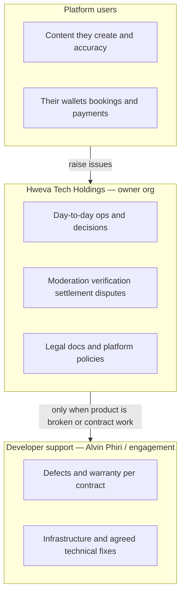

# Data Ownership

| Field | Value |
| --- | --- |
| **Title** | Town Ruins Owner Pack — Data Ownership |
| **Audience** | Platform owners (Hweva Tech Holdings) |
| **Version** | 1.0 |
| **Product** | [https://app.townruins.com](https://app.townruins.com) |
| **Support** | [sandbox@townruins.com](mailto:sandbox@townruins.com) |
| **Related** | [10 Roles and Permissions](10-Roles-and-Permissions.md) · [06 Feature Catalogue](06-Feature-Catalogue.md) · [14 Support and Warranty](14-Support-and-Warranty.md) |

---

## Purpose

This document answers: **who is responsible for what data** after go-live — the **owner organisation**, **platform users**, or **developer support** (bounded by the full-time contract).

**Default rule:** Hweva Tech Holdings owns **day-to-day operations**. The developer is not the first-line operator for accounts, listings, bookings, tokens, or moderation. Escalate to developer support for defects, warranty work, and agreed technical assistance — not for routine business decisions.

---

## Responsibility model

| Party | Primary responsibility |
| --- | --- |
| **Owner organisation (Hweva Tech Holdings)** | Operate the live product: moderation, verification decisions, settlements, disputes, reports, legal content, staff admin accounts, and user support first line |
| **Platform users** (tenants, landlords, providers) | Accuracy and lawfulness of their own content; their login credentials; their payment instruments with third-party processors |
| **Developer** (delivery counter-party) | Fix defects; honour warranty/support **per full-time contract**; advise on technical recovery when owner ops cannot resolve |

---

## Ownership by data domain

### 1. User accounts

| Aspect | Who owns / is responsible |
| --- | --- |
| Creating public accounts (sign-up) | **User** creates; platform stores |
| Email verification and password reset | **User** self-service; **owner** supports when stuck (spam, resend guidance) |
| Admin / super admin accounts | **Owner** — provision, secure, rotate credentials; never share |
| Suspending / deleting accounts | **Owner** decision and action (admin tools / controlled process) |
| “I cannot log in” first response | **Owner** support process |
| Auth system broken for everyone | **Developer** (incident / warranty) |

**Owner default:** You decide who may be an admin. You handle ordinary access problems. You do not wait for the developer to reset every forgotten password.

---

### 2. Property information (long-term listings)

| Aspect | Who owns / is responsible |
| --- | --- |
| Listing content (description, rent, amenities, location, rules) | **Landlord** is responsible for accuracy |
| Publishing and renewing / restoring listings | **Landlord** (TR restore costs) |
| Deactivating or reviving listings for policy/ops reasons | **Owner** (admin listing tools) |
| One active listing limit | Product rule; **owner** explains, does not invent exceptions without product change |
| Fraudulent or illegal listing content | **Owner** moderates; may deactivate; escalate only if tooling is broken |

**Owner default:** Landlords own their listing truth. You own **marketplace integrity** (what stays visible).

---

### 3. Images

| Aspect | Who owns / is responsible |
| --- | --- |
| Uploading listing / accommodation photos | **Landlord** or **Provider** (as applicable) |
| Image quality and rights to use the photo | **Uploader** (user) |
| Removing images as part of moderation / takedown | **Owner** |
| Upload service misconfiguration (storage CORS, broken signed URLs) | **Developer** / technical ops under engagement |

**Owner default:** Users supply and are responsible for what they upload. You remove or hide content that violates policy.

---

### 4. Temporary stay inventory and bookings

| Aspect | Who owns / is responsible |
| --- | --- |
| Accommodation and room details, rates, availability | **Provider** |
| Guest booking request and payment initiation | **Tenant (guest)** |
| Confirm / decline (request mode) | **Provider** |
| Cancellation per published policy | **Guest** / **Provider** per rules; **owner** when policy disputes arise |
| Platform commission rate | **Owner** sets via admin tools |
| Marking booking **settled** | **Owner** (admin settlement) |
| Payment provider outages or webhook failures | **Owner** first-line awareness; **developer** for platform integration defects |

**Owner default:** Providers run inventory; guests book; **you** run verification, moderation, settlement, and dispute outcomes.

---

### 5. Payments (real money)

| Aspect | Who owns / is responsible |
| --- | --- |
| Card / EcoCash credentials | **User** with the **payment provider** (Paynow / Stripe, etc.) — not stored as full card data on Town Ruins |
| Stay booking charges, refunds, cancellations | Product + payment provider; **owner** oversees disputes and settlement status |
| Listing fees / premium subscription payments (when live) | User pays; **owner** supports status questions using admin/booking/payment views |
| Choosing and configuring production payment mode | **Owner** commercial decision + **developer** technical configuration under engagement |
| Chargebacks / provider-side payment investigation | **Owner** with payment provider; developer only if app integration is at fault |

**Owner default:** Money movement for stays is a **business operations** concern. Developer support is for **software defects**, not for every guest refund decision.

---

### 6. TR Token balances and wallet history

| Aspect | Who owns / is responsible |
| --- | --- |
| Wallet balance and transaction history records | Platform records; **user** owns use of their balance |
| Welcome bonus, engagement debit, restore debit | Product rules; automatic |
| Promo / correction grants | **Owner** decision (support goodwill); technical grant path may require API/DB — still an **owner** request, not a developer product decision |
| “Missing tokens” investigation | **Owner** first (check history, verification, engagements); escalate if ledger is inconsistent due to a bug |
| Demo-only token **purchase** path | Known product limit; **owner** communicates honestly; **developer** for wiring real token payments if contracted |

**Owner default:** Token economy is your commercial surface. You investigate balance complaints. You do not outsource every “I spent 5 TR” ticket to the developer.

---

### 7. Reports, disputes, reviews, legal text

| Aspect | Who owns / is responsible |
| --- | --- |
| Filing a report or dispute | **User** |
| Outcome of report / dispute | **Owner** (admin review, resolve, dismiss, close) |
| Review visibility (publish / unpublish) | **Owner** |
| Legal document wording (terms, privacy, etc.) | **Owner** (policy ownership); tools to publish versions are in admin |
| Audit log retention policy | **Owner** to define and enforce |

**Owner default:** Trust & safety and legal publication are **owner** responsibilities.

---

## Boundary: owner vs developer support

| Situation | First owner | Escalate to developer when… |
| --- | --- | --- |
| User cannot log in (unverified email, wrong password) | Owner support | Platform-wide auth outage or mail system misconfiguration confirmed technical |
| Listing not showing | Owner checks status / expiry / inactive | Scanner or search is broken for all listings |
| Provider waiting for approval | Owner completes verification in admin | Admin action fails due to product defect |
| Booking payment stuck | Owner checks booking/payment status and policy | Payment integration / webhook defect |
| Token balance dispute | Owner reviews wallet history | Proven incorrect ledger behaviour |
| Feature request / roadmap item | Owner product decision | Only if contracted as change work |
| Routine moderation backlog | **Owner staff** | Never “because we prefer not to log in” |

Support contact for engagement questions: [sandbox@townruins.com](mailto:sandbox@townruins.com). Response expectations follow the **full-time contract** — this pack does not invent SLA numbers. See [14 Support and Warranty](14-Support-and-Warranty.md) when published.

---

## Practical checklist for owner staff

1. **Assume ownership first.** If the action exists in the admin panel, it is yours.
2. **Document decisions** that affect money or bans (who, when, why) — audit logs help, but your internal notes matter for disputes.
3. **Protect admin accounts.** Individual credentials; strong passwords; no sharing.
4. **Treat irreversible actions carefully** — especially account deletion (cascades across listings, bookings, and related data).
5. **Escalate software failures**, not business preferences, to the developer under the contract.

---

## Summary table

| Data domain | Primary content owner | Day-to-day operator | Developer role |
| --- | --- | --- | --- |
| User accounts | User + owner (admins) | Owner support / admin tools | Defects, recovery tooling |
| Listing property info | Landlord | Owner moderation | Defects only |
| Images | Uploader | Owner takedown | Storage/upload defects |
| Stay inventory | Provider | Owner verification & moderation | Defects only |
| Bookings | Guest + provider | Owner settlement & disputes | Payment integration defects |
| Real payments | User + payment provider | Owner oversight | Integration/warranty |
| TR balances | User (usage) + platform ledger | Owner investigations & promos | Ledger bugs; live purchase work if contracted |
| Legal & trust content | Owner | Owner publishes via admin | CMS/tooling defects |

**Bottom line:** Hweva Tech Holdings runs Town Ruins. Platform users own the truth of their own content and money instruments. The developer supports the product under contract — and is **not** the default operator of your data or queues.
